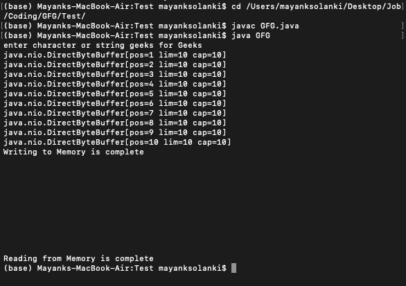

# 什么是 Java 中的内存映射文件？

> 原文:[https://www . geesforgeks . org/什么是内存映射 java 文件/](https://www.geeksforgeeks.org/what-is-memory-mapped-file-in-java/)

内存映射文件是 Java 中的临时特殊文件，有助于直接从内存访问内容。Java 编程支持带有 java.nio 包的内存映射文件。内存映射输入/输出使用文件系统来建立从用户直接到文件系统页面的虚拟内存映射。它可以简单地视为一个大数组。用于加载内存映射文件的内存在 Java 堆空间之外。

这里我们使用 MappedByteBuffer 从内存中读写。该实用程序可用于创建和存储高效的内存映射文件。关于 MappedByteBuffer 的一些主要重要特性如下:

1.  MappedByteBuffer 和文件映射在垃圾收集之前保持有效。 ***可能是清除内存映射文件的唯一选项。***
2.  在内存映射文件中的读写通常由操作系统完成，以将内容写入磁盘。
3.  为了获得更好的性能，首选直接缓冲区而不是间接缓冲区。
4.  用于加载文件的内存在 Java 堆之外，驻留在共享内存上，这允许我们以两种不同的方式访问文件。顺便说一下，这取决于您使用的是直接缓冲区还是间接缓冲区。

在总结内存映射文件的优点和缺点之前，让我们进行滚动并实现同样的操作

**示例:**

## Java 语言(一种计算机语言，尤用于创建网站)

```java
// Java Program to illustrate Memory Mapped File via
// RandomAccessFile to open a file using FileChannel's map()
// method

// Importing standard classes from respective packages
import java.io.*;
import java.io.RandomAccessFile;
import java.nio.MappedByteBuffer;
import java.nio.channels.FileChannel;
import java.util.Scanner;

// Main class
public class GFG {

    // The next line shows 10 MB as the max value of the
    // count
    private static int count = 10485760;

    // Main driver method
    public static void main(String[] args) throws Exception
    {

        // Display message asking user to enter the input
        // string
        System.out.print("enter character or string");

        // The method RandomAccessFile has an object sc and
        // is used to create a text file

        // Try block to check for exceptions
        try (RandomAccessFile sc
             = new RandomAccessFile("text.txt", "rw")) {

            // Scanner class to take objects input
            // Taking String a as input
            Scanner s = new Scanner(System.in);

            String a;

            a = s.next();

            // Mapping the file with the memory
            // Here the out is the object
            // This command will help us enable the read and
            // write functions
            MappedByteBuffer out = sc.getChannel().map(
                FileChannel.MapMode.READ_WRITE, 0, 10);

            // Writing into memory mapped file
            // taking it as 10 and printing it accordingly
            for (int i = 0; i < 10; i++) {
                System.out.println((out.put((byte)i)));
            }

            // Print the display message as soon
            // as the memory is done writing
            System.out.println(
                "Writing to Memory is complete");

            // Reading from memory mapped files
            // You can increase the size , it not be 10 , it
            // can be higher or lower Depeding on the size
            // of the file
            for (int i = 0; i < 10; i++) {
                System.out.println((char)out.get(i));
            }

            // Display message on the console showcasing
            // successful execution of the program
            System.out.println(
                "Reading from Memory is complete");
        }
    }
}
```

**输出:**



到目前为止，我们已经研究了什么和为什么我们使用内存映射文件，并看到了实现。但是有了这些优点，也有缺点，如下所示:

**内存映射文件的优点如下:**

*   **性能**:内存映射文件比标准文件快很多。
*   **共享延迟:**文件可以共享，让您在进程之间共享内存，并且延迟比使用环回套接字低 10 倍以上。
*   **大文件:**它可以让我们展示那些无法访问的大文件。它们更快更干净。

**内存映射文件的缺点如下:**

*   **故障** : 内存映射文件的缺点之一是随着内存的不断增加，页面故障的数量也在不断增加。由于只有一小部分进入内存，如果内存中没有您可能请求的页面，可能会导致页面错误。但值得庆幸的是，大多数操作系统通常可以映射所有内存，并使用 Java 编程语言直接访问它。