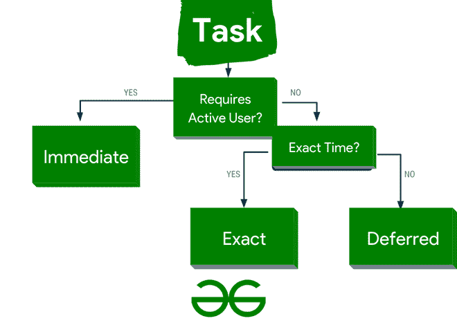

# 安卓后台处理用什么？

> 原文:[https://www . geeksforgeeks . org/安卓后台处理使用什么/](https://www.geeksforgeeks.org/what-to-use-for-background-processing-in-android/)

默认情况下， ***应用程序代码在主线程*** 内运行。因此，每个语句都是按顺序执行的。如果执行持续时间较长的操作，设备会一直阻塞，直到相应的操作完成。为了提供诚实的用户体验，安卓应用程序中所有可能运行缓慢的操作都应该异步运行。这将通过 Java 语言或安卓框架的并发结构来存档。潜在的慢操作例如:网络、文件和数据库访问，复杂的计算和类似的任务需要后台处理，让我们深入一点，详细了解一下！

安卓修改界面，从一个线程(称为 most 线程)处理输入事件。安卓在一个队列中收集这个线程期间的所有事件，并用一个 Looper 类的实例处理这个队列。安卓操作系统使用线程类来执行异步任务，就像上面提到的头文件一样。它还提供了 *java.util.concurrent* 来执行某些任务，我们称之为**后台。通过使用*线程池和执行器类。***

如果您想要从替换线程更新接口，您想要与最多的线程同步。由于这些限制，Android 开发人员通常使用 Android 特定的代码构造。

### 这里有一个例子

RxJava 开源框架允许指定一个可观察的知识流的观察者。一旦事件发生并被报告完成，观察者就由框架命名。您将配置观察者和可观察对象在哪个线程中运行。

### 背景工作到底是什么？

只要满足以下每个条件，应用程序就会被视为在后台运行:

1.  设备正在使用时，应用程序未处于运行状态，也未执行任何前台服务。
2.  应用程序的活动(页面)或片段目前都不可见使用它的人

**可以从下图中获取一个简单的字形来理解这个过程:**



**图 1**

### 背景任务的类别

**背景任务属于后续主要类别之一:**

1.  马上
2.  延期的
3.  确切的

对任务进行分类，回答后续问题，遍历*中对应的决策树(图 1:*

*   当用户与应用程序交互时，任务是否自行完成？什么事？那么这应该被归类为直接执行吗？如果没有，进入第二个问题。
*   任务是否在特定时间开始运行？如果你要在某个特定的时间运行一个任务，**将任务分类为精确。**

大多数任务不会在特定时间运行。任务运行后，通常会在网络可用性和剩余电量等支持条件下略有变化。

*   不能在特定时间运行的任务应被归类为延期任务。

**这些任务可以在安卓中用于后台处理，让我们详细了解一下:**

**1。即时任务**

对于应该立即执行并希望继续处理的任务，尽管用户将设备置于后台或设备重新启动，我们建议使用工作管理器及其对长时间运行任务的支持。在特定情况下，比如使用**媒体播放或主动导航，你可能会想直接使用前台服务。**

****2。** **延期任务****

**每一个与用户交互有间接联系并且可能在未来任何时间运行的任务都是**经常**被**推迟**。延迟任务的推荐解决方案是工作管理器。工作管理器使安排异步和可推迟的任务变得非常有效和容易，甚至是当电话重启时需要恢复的任务！**

****3。精确任务****

**必须在特定时间点执行的任务，他们可以使用[警报管理器](https://www.geeksforgeeks.org/how-to-build-a-simple-alarm-setter-app-in-android/)。**

### ****螺纹&处理器****

**用一个可运行的初始化线程，然后继续执行任何繁重的操作。默认情况下，视图有一个处理程序，所以您将执行 View.post()。处理程序是在创建的线程上运行的繁重任务和用户界面线程之间的通信方式。**

## **Java 语言(一种计算机语言，尤用于创建网站)**

```java
Thread thread = new Thread(new Runnable() {
    @Override
    public void run() {
        final String result = performBlockingTask();
        // GfG Thread Example
        runOnUiThread(new Runnable() {
            @Override
            public void run() {
                mTextView.setText(result);
            }
        });
    }
});
thread.start();
```

****问题:****

*   **不支持配置更改，换句话说，如果我们的应用程序支持两种方向(横向和纵向)，当用户旋转设备时，我们必须处理线程和处理器的状态。**
*   **样板代码和不友好的阅读。**
*   **没有错误处理程序。**

### **互联网服务**

**当需要在后台运行不影响用户界面的任务时很有用。他们完全脱离了视野。**

## **Java 语言(一种计算机语言，尤用于创建网站)**

```java
public class BackgroundServiceGfG extends IntentService {

    private static final String TAG = BackgroundServiceGfG.class.getSimpleName();

    public BackgroundServiceGfG() {
        super(TAG );
    }

    @Override
    protected void onHandleIntent(Intent intent) {
        blockingTask();
    }
}
```

> *****极客提示:*** 它必须像其他服务一样在 AndroidManifest.xml 中声明。然后只需发送一个意图就可以推送它(它甚至可以包含任何参数！)**

****问题:****

*   **与用户界面没有直接的交流。**

### **阿明克塔斯克**

**在后台运行指令，并再次与最线程同步。对简短的后台操作很有用。在此阅读更多[。](https://developer.android.com/reference/android/os/AsyncTask)**

## **Java 语言(一种计算机语言，尤用于创建网站)**

```java
new AsyncTask<Void, Void, String>() {
    @Override
    protected void onPreExecute() {
        // Creating a Sample Async Task
    }

    @Override
    protected String doInBackground(Void... voids) {
        return performBlockingTask();
    }

    @Override
    protected void onProgressUpdate(Integer... progress) {
        mProgessBar.setProgress(progress);
    }

    @Override
    protected void onPostExecute(String result) {
        mTextView.setText(result);
    }

}.execute();
```

****问题:****

*   **不支持配置更改。**
*   **没有错误处理程序，所以我们必须询问 onPostExecute 结果是否是错误的。**

**每个异步任务实例通常只执行一次。**

### **结论**

**至此，我们结束了关于背景处理的文章，正如您所看到的，方法存在某些问题，因此选择正确的方法(适合您的需要)应该是一件容易的事情！**