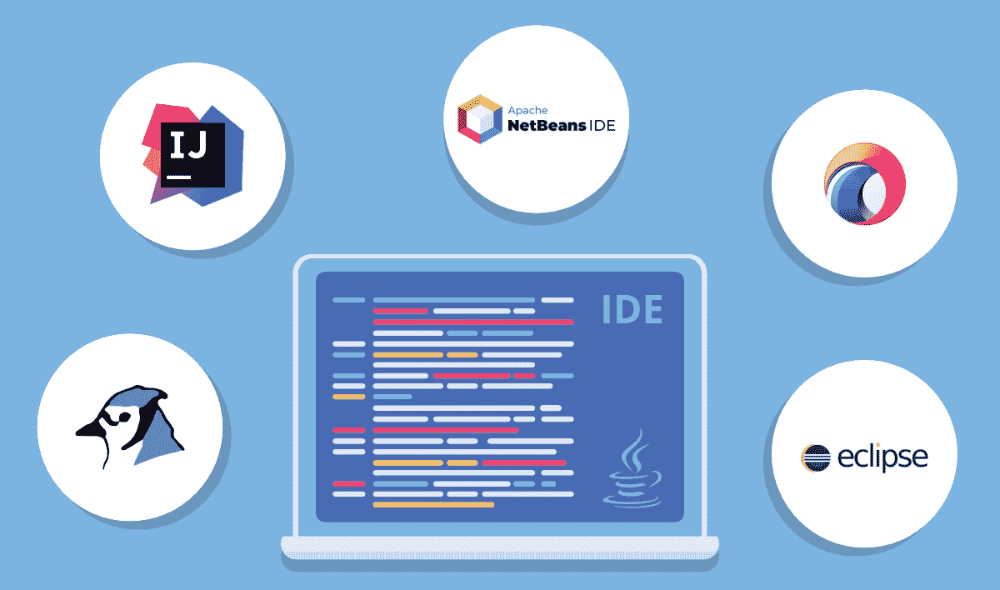

# 2020 年最好的 Java IDE 会是什么？

> 原文:[https://www . geesforgeks . org/2020 年最佳 Java ides/](https://www.geeksforgeeks.org/what-will-be-the-best-java-ides-in-2020/)

当我们谈论流行的编程语言时，记住**[【Java】](https://www.geeksforgeeks.org/java/)**很重要！事实上，它是目前世界上[最流行的编程语言](https://www.tiobe.com/tiobe-index/)，每天大约有 **70 个 Lakh 开发者**使用它。其中一个原因是 Java 的多功能性。无论是桌面应用程序、移动应用程序还是网络应用程序，你都可以命名，Java 可以创建它们！！！

由于这种流行，Java 有许多 IDE 可供您使用。这些集成开发环境在应用程序开发过程中提供了巨大的帮助。通过使用它们，您可以节省时间和精力，并在您的团队或公司中创建标准的开发流程。而世界上最受欢迎的 Java IDE 有 **Eclipse、IntelliJ IDEA、NetBeans** 等。根据您的规范，您可以使用许多其他 IDE。

因此，请查看本文中的**最佳 Java IDE 的**，这样您就可以根据它们的特性和您的需求来决定您希望使用哪一个。

### 1.[日食](https://www.eclipse.org/downloads/)

Eclipse 是一个 Java 集成开发环境，是世界上最大和最受欢迎的三个集成开发环境之一。它主要是用 Java 编写的，但是除了使用插件的 Java 之外，它也可以用来开发其他编程语言的应用程序。Eclipse 的一些特性如下:

*   对于希望在应用程序中创建特定功能的 Java 程序员来说，Eclipse 中提供了 PDE(插件开发环境)。
*   Eclipse 为应用程序开发中的各种过程展示了强大的工具，如图表、建模、报告、测试等。以便 Java 开发人员可以尽可能快地开发应用程序。
*   Eclipse 还可以使用 TeXlipse 插件和 Mathematica 软件的包，用 LaTeX 创建各种数学文档。
*   Eclipse 可以在 Linux、macOS、Solaris 和 Windows 等平台上使用。

### 2.[蓝色](https://www.bluej.org/)

BlueJ 是一个 Java IDE，被世界上的 Java 程序员广泛使用。虽然它最初是为教育目的开发的，但它在软件开发中也很有用，尽管规模较小。BlueJ 的一些特性如下:

*   BlueJ 的基本设计不同于其他 IDE，因为它主要是为了向初学者教授 OOPS 而创建的。所以交互界面干净易用。
*   BlueJ 上的主屏幕显示了当前开发应用程序的类结构，在其中可以轻松访问和修改对象。
*   所有的 OOPS 元素，比如类、对象等等。可以很容易地在 BlueJ 上使用类似于 UML 的图表以可视化格式表示。
*   BlueJ 可以在 Linux、macOS 和 Windows 等平台上使用。

### 3.[智能创意](https://www.jetbrains.com/idea/)

IntelliJ IDEA 是一个 Java IDE，是世界上 3 个最大和最流行的 IDE 之一。它有两个版本，即免费开源社区版和付费终极版。IntelliJ IDEA 的一些特性如下:

*   IntelliJ IDEA 的两个版本都支持各种编程语言，如 Java、Scala、Kotlin、Groovy 等。
*   IntelliJ IDEA 中有很多功能可以让编程变得更简单，比如调试、代码完成、代码检查、XML 编辑支持、代码重构、单元测试、TestNG 等。
*   其他一些只在付费的 Ultimate 版本中提供的工具有重复检测、JavaScript 和数据库工具、Perforce 集成等。
*   IntelliJ IDEA 可以在 Linux、macOS 和 Windows 等平台上使用。

### 4. [jGRASP](https://www.jgrasp.org/)

jGRASP 是一个轻量级的 Java IDE，使用 Java 编写，可以使用 Java 虚拟机在所有平台上运行。它是一个集成的调试器，也是一个为 Java 开发人员提供各种工具的工作台。jGRASP 的一些特性如下:

*   使用 jGRASP 可以很容易地为应用程序生成复杂性概要图和 UML 类图。
*   jGRASP 是一个轻量级的 Java IDE，但是它仍然可以在运行时生成应用程序源代码结构及其数据结构的静态可视化。
*   虽然 jGRASP 是用 Java 编写的，但它仍然可以为 C、C++、Python、Ada、Objective-C 等其他编程语言创建 CSDs(控制结构图)。
*   jGRASP 可以在 Linux、macOS 和 Windows 等平台上使用。

### 5.JC 反应器

JCreator 是一个轻量级的 Java IDE，它有一个像微软的 Visual Studio 一样的接口。它有 3 个版本，即精简版(LE)、专业版(Pro)和精简版-专业版。JCreator 的一些特性如下:

*   因为 JCreator 是一个用 C++编程的 Java IDE，所以它不需要 JRE 来执行 Java 代码。这意味着它比用 Java 编程的其他 Java IDEs 更快。
*   JCreator 的付费版本具有与其他 Java IDEs 类似的各种功能，例如 Ant 支持、项目管理、代码向导和调试器。然而，它没有像自动重构、支持通用框架等高级特性。
*   尽管有一些缺点，JCreator 是一个非常适合初学者的 Java IDE，因为它体积小，速度快。
*   JCreator 可以在 Linux(通过 Wine)和 Windows 等平台上使用。

### 6.netbeans

NetBeans 是一个 Java IDE，是世界上 3 个最大和最流行的 IDE 之一。这是一个开源 IDE，允许 Java 程序员使用模块集构建各种应用程序。NetBeans 的一些功能如下:

*   NetBeans 可用于各种操作系统，如 Windows、Linux、macOS、Solaris 等。它还有一个功能受限的独立于操作系统的版本。
*   使用 NetBeans 创建自定义软件应用程序非常容易，因为它在语法和语义上突出了 Java 代码。此外，还有许多工具可以帮助编写无 bug 的代码。
*   虽然 NetBeans 主要是一个 Java IDE，但它有扩展，可以用其他编程语言工作，如 C、C++、PHP、HTML5、JavaScript 等。
*   NetBeans 可以在 Linux、macOS、Solaris 和 Windows 等平台上使用。

### 7.绿脚

Greenfoot 是一个 Java IDE，它是为高中和本科学生提供教育而开发的。它是由甲骨文支持维护的免费软件。格林福特的一些特点如下:

*   使用 Greenfoot 可以很容易地开发二维图形应用程序，这些应用程序的主要例子是模拟、交互式游戏等。
*   Greenfoot 能够显示许多 OOPS 特性，例如类与对象的关系、方法、对象交互、参数等。
*   此外，它很容易获得动画和声音，因为它原本是一种学习媒介。
*   Greenfoot 可以在 Linux、macOS、Solaris 和 Windows 等平台上使用。

### 8. [JDeveloper](https://www.oracle.com/technologies/developer-tools/jdeveloper/jdeveloper.html)

JDeveloper 是由甲骨文公司提供的免费 Java IDE。可以用来开发除了 Java 以外的各种语言的应用，比如 XML、 [HTML](https://www.geeksforgeeks.org/html-tutorials/) 、 [SQL](https://www.geeksforgeeks.org/sql-tutorial/) 、PL/SQL、 [JavaScript](https://www.geeksforgeeks.org/javascript-tutorial/) 、 [PHP](https://www.geeksforgeeks.org/php/) 等。JDeveloper 的一些特性如下:

*   JDeveloper 为应用程序的整个开发生命周期提供了各种功能，包括设计、编码、调试、优化、部署等。
*   JDeveloper 还通过为应用程序提供许多可视化开发工具以及创建高级编码环境所需的所有工具，简化了应用程序开发过程。
*   JDeveloper 可以与 Oracle 应用程序开发框架(Oracle ADF)集成，后者是一个基于 Java EE 的端到端框架。这确保了应用程序开发过程变得更加容易。
*   JDeveloper 可以在 Linux、macOS 和 Windows 等平台上使用。

### 9.[髓鞘](https://www.genuitec.com/products/myeclipse/)

MyEclipse 是一个构建在 Eclipse 平台上的 Java IDE，它提供了一个不同的特性集。它有 5 个版本，即专业版、标准版、蓝色版、春季版和珠光版。MyEclipse 的一些特性如下:

*   MyEclipse 中有多种工具可用，如数据库工具、持久性工具、可视化网页设计器、Spring 工具等。它也可以用于 Java 应用程序开发和 web 开发。
*   MyEclipse 为网页语言和框架提供支持，如 HTML、JavaScript、Angular、TypeScript 等。
*   MyEclipse IDE 提供的一些其他特性是 Maven 项目管理、Swing GUI 设计支持、Spring Tooling、WebSphere 连接器、数据库连接器等。
*   MyEclipse 可以在 Linux、macOS 和 Windows 等平台上使用。

### 10.干 Java

DrJava 是一个免费的轻量级 Java IDE，主要是为学生和 Java 初学者创建的。然而，它也为 Java 专家提供了更强大的功能。DrJava 的一些特性如下:

*   DrJava 可以从控制台交互评估 Java 代码，并且还可以在同一个控制台中呈现输出。
*   与其他一些 IDE 不同，DrJava 在不同的平台上有一致的外观。这是因为它是使用太阳微系统公司的 Swing 工具包开发的。
*   DrJava 中可供专业 Java 程序员使用的一些特性是注释、自动完成、语法着色、自动缩进、大括号匹配等。
*   DrJava 可以在 Linux、macOS 和 Windows 等平台上使用。