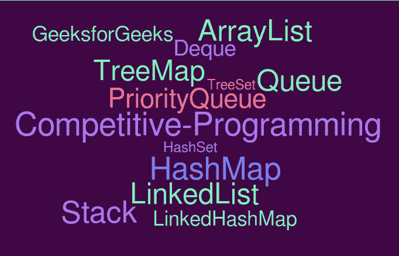

# 哪些 Java 库对竞争性编程有用？

> 原文:[https://www . geesforgeks . org/哪些 java 库对竞争性编程有用/](https://www.geeksforgeeks.org/which-java-libraries-are-useful-for-competitive-programming/)

[Java](https://www.geeksforgeeks.org/java/) 是竞争编程中最值得推荐的语言之一(更多详情请参考 a [上一篇文章](https://www.geeksforgeeks.org/how-to-be-a-good-programmer-in-college/)

[Java Collection](https://www.geeksforgeeks.org/collections-in-java-2/) 框架包含许多容器，这些容器对于不同的目的都很有用。在本文中，我们将从[竞技编程](https://www.geeksforgeeks.org/how-to-begin-with-competitive-programming/)和面试准备的角度来关注最重要的容器。

**[数组列表](https://www.geeksforgeeks.org/arraylist-in-java/)** :动态大小的数组，允许插入和删除，而不考虑数组的大小。它还具有普通数组的优点，如随机访问和缓存友好性。Java ArrayList 支持很多附加操作，比如 [indexOf()](https://www.geeksforgeeks.org/java-util-arraylist-indexof-java/) 、 [remove()](https://www.geeksforgeeks.org/arraylist-linkedlist-remove-methods-java-examples/) 等。普通数组不支持这些函数。

**[队列](https://www.geeksforgeeks.org/queue-interface-java/)** :由[链接列表](https://www.geeksforgeeks.org/linked-list-in-java/)实现的接口。在我们希望有先进先出的项目顺序的情况下很有用。示例问题是，[生成具有给定数字](https://www.geeksforgeeks.org/interesting-method-generate-binary-numbers-1-n/)、[流中的第一个非重复字符](https://www.geeksforgeeks.org/find-first-non-repeating-character-stream-characters/)、[树的层级顺序遍历](https://www.geeksforgeeks.org/level-order-tree-traversal/)及其变体、[图的 BFS](https://www.geeksforgeeks.org/breadth-first-search-or-bfs-for-a-graph/)及其变体。更多练习请参考[队列练习题](https://practice.geeksforgeeks.org/explore/?category%5B%5D=Queue&page=1)。

:用于我们希望有后进先出订单的情况。示例问题有[平衡括号](https://www.geeksforgeeks.org/check-for-balanced-parentheses-in-an-expression/)、[库存跨度问题](https://www.geeksforgeeks.org/the-stock-span-problem/)、[下一个较大的元素](https://www.geeksforgeeks.org/next-greater-element/)和[直方图中最大的区域](https://www.geeksforgeeks.org/largest-rectangle-under-histogram/)。更多练习请参考[叠练题](https://practice.geeksforgeeks.org/explore/?category%5B%5D=Stack&page=1)。

**[【德雀】](https://www.geeksforgeeks.org/deque-interface-java-example/)** :德雀是一个由 LinkedList 类实现的接口。出列支持 O(1)时间内两端的插入和删除。我们可以使用 Deque 接口来实现 Queue 和 Stack 两者。实际上，推荐使用 Deque 在 Java 中实现 Stack，因为 Java 中的 Stack 类是一个老式的类。德格上的示例问题是，[访问所有汽油泵](https://www.geeksforgeeks.org/find-a-tour-that-visits-all-stations/)和所有 k 尺寸子阵列的[最大值。](https://www.geeksforgeeks.org/sliding-window-maximum-maximum-of-all-subarrays-of-size-k/)

Java 中的[集合](https://www.geeksforgeeks.org/set-in-java/)(下面讨论的 TreeSet、HashSet 和 LinkedHashSet)用于存储键的集合，Java 中的[映射](https://www.geeksforgeeks.org/map-interface-java-examples/)(下面讨论的 TreeMap、HashMap 和 LinkedHashMap)用于存储键值对的集合。

**[树形图](https://www.geeksforgeeks.org/treeset-in-java-with-examples/)** 和 **[树形图](https://www.geeksforgeeks.org/treemap-in-java/)** :这两个都实现了[自平衡二叉查找树](https://www.geeksforgeeks.org/self-balancing-binary-search-trees-comparisons/)(特别是[红黑树](https://www.geeksforgeeks.org/red-black-tree-set-1-introduction-2/))。在我们希望使用中等(优于数组，劣于散列)搜索、插入和删除查询时间来维护已排序项目的情况下，这非常有用。示例问题有，[最接近左侧的更大或相同的值](https://www.geeksforgeeks.org/closest-greater-or-same-value-on-left-side-for-every-element-in-array/)，[为 arra 中的每个元素找到最接近的值](https://www.geeksforgeeks.org/find-closest-value-for-every-element-in-array/) y 等。当我们希望只存储键时，我们使用 TreeSet 当我们希望存储键值对时，我们使用 TreeMap。

**[HashSet](https://www.geeksforgeeks.org/hashset-in-java/) 和 **[HashMap](https://www.geeksforgeeks.org/java-util-hashmap-in-java/)**** :这两个都实现了带链接的哈希。当我们希望快速搜索、插入和删除(所有三个操作都是 O(1))时很有用。这是业内最常用的数据结构之一，也是学术界最低估的。常见的问题有很多，c [计算不同的元素](https://www.geeksforgeeks.org/count-distinct-elements-in-an-array/)、[数组项的频率](https://www.geeksforgeeks.org/counting-frequencies-of-array-elements/)、[两个未排序数组的和为 0 的子数组](https://www.geeksforgeeks.org/find-if-there-is-a-subarray-with-0-sum/)和[的并集和交集](https://www.geeksforgeeks.org/find-union-and-intersection-of-two-unsorted-arrays/)。更多练习请参考[哈希练习题](https://practice.geeksforgeeks.org/explore/?category%5B%5D=Hash&page=1)。

**[链接 HashSet](https://www.geeksforgeeks.org/linkedhashset-in-java-with-examples/)** 和 **[链接 HashMap](https://www.geeksforgeeks.org/linkedhashmap-class-java-examples/)** :实现带链接的哈希，另外还要维护插入顺序。HashSet 和 HashMap 不维护任何顺序。因此，如果我们希望按照输入中出现的相同顺序打印不同的元素，我们需要使用 LinkedHashSet，如果我们希望按照项目出现的相同顺序打印项目及其频率，我们需要使用 LinkedHashMap。

**[优先级队列](https://www.geeksforgeeks.org/priority-queue-class-in-java-2/)** :默认实现[最小堆](https://www.geeksforgeeks.org/binary-heap/)。我们也可以通过将 Collections.reverseOrder()作为参数来创建最大堆。每当我们希望高效地找到最小或最大元素时，就使用优先级队列。用于实现 [Prim 的算法、](https://www.geeksforgeeks.org/prims-minimum-spanning-tree-mst-greedy-algo-5/)T8】Dijkstra 的最短路径、 [Huffman 编码](https://www.geeksforgeeks.org/huffman-coding-greedy-algo-3/)、 [K 个最大元素](https://www.geeksforgeeks.org/k-largestor-smallest-elements-in-an-array/)、[最大购买玩具](https://www.geeksforgeeks.org/maximise-the-number-of-toys-that-can-be-purchased-with-amount-k/)、[合并 K 个排序数组](https://www.geeksforgeeks.org/merge-k-sorted-arrays-set-2-different-sized-arrays/)、[一个流的中位数](https://www.geeksforgeeks.org/median-of-stream-of-integers-running-integers/)等流行算法。更多练习请参考[堆练习题](https://practice.geeksforgeeks.org/explore/?category%5B%5D=Heap&page=1)。

在本文的下一部分，我们将介绍更重要的 Java 库。