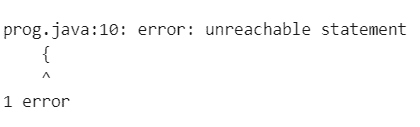
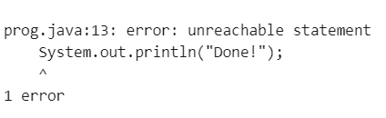
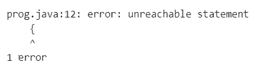
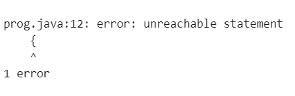

# 使用编译时间常数循环时

> 原文:[https://www . geesforgeks . org/while-loop-with-compile-time-constants/](https://www.geeksforgeeks.org/while-loop-with-compile-time-constants/)

[While 循环](https://www.geeksforgeeks.org/java-while-loop-with-examples/)是一个控制流语句，允许基于给定的布尔条件重复执行代码。while 循环可以看作是一个重复的 if 语句。它主要用于预先确定迭代次数的情况。下图说明了 while 循环:


**语法:**

```java
while(test_expression)
{
   // statements 
   update_expression;
}
```

**程序 1:** 下面是实现基本 while 循环的程序:

## Java 语言(一种计算机语言，尤用于创建网站)

```java
// Java program to illustrate the
// while loop

class GFG {

    // Driver Code
    public static void main(String args[])
    {
        // Initialization expression
        int i = 1;

        // Test expression
        while (i < 6) {
            System.out.println("Hello World");

            // Update the expression
            i++;
        }
    }
}
```

**Output:**

```java
Hello World
Hello World
Hello World
Hello World
Hello World

```

### **<u>带布尔值循环</u>**

**程序 1:** 下面是另一个 while 循环的例子，其中在 test_expression 部分使用了一个布尔变量:

## Java 语言(一种计算机语言，尤用于创建网站)

```java
// Java program to demonstrate while loop
import java.io.*;

class GFG {
    // Driver Code
    public static void main(String[] args)
    {
        boolean flag = false;

        while (flag) {
            System.out.println(
                "While Loop Executed");
        }

        System.out.println("Done!");
    }
}
```

**Output:**

```java
Done!

```

**解释:**上面的代码工作正常，因为标志不是编译时常数。该标志的值为 false，因此不会执行 while 循环。

**程序 2:** 下面是 while 循环的例子，其中在 test_expression 部分使用了一个常量布尔值，而不是像上面的例子那样使用布尔变量。

## Java 语言(一种计算机语言，尤用于创建网站)

```java
// Java program to demonstrate the
// above statement

import java.io.*;
class GFG {
    // Driver Code
    public static void main(String[] args)
    {
        while (false) {
            System.out.println(
                "While Loop Executed");
        }
        System.out.println("Done!");
    }
}
```

**输出:**

[](https://media.geeksforgeeks.org/wp-content/uploads/20201206165746/whieloop.PNG)

**解释:**上述代码在循环不可达的情况下无法编译为内部代码。

**程序 3:** 下面是演示 test_expression 为“真”时的场景的程序:

## Java 语言(一种计算机语言，尤用于创建网站)

```java
// Java program to demonstrate the
// above statement
import java.io.*;

class GFG {

    // Driver Code
    public static void main(String[] args)
    {
        while (true) {
            System.out.println(
                "While Loop Executed");
        }
        System.out.println("Done!");
    }
}
```

**输出:**

[](https://media.geeksforgeeks.org/wp-content/uploads/20201206170030/GFGwhileloop.PNG)

**解释:**在上面的代码中，while 循环将被成功编译，但是它将结束于一个[无限循环](https://www.geeksforgeeks.org/interesting-infinite-loop-using-characters-in-c/)中，因此 while 循环之后的代码是不可达的。因此，它也会导致编译错误。

**程序 4:** 下面是上面程序的另一个版本，while 循环中有一个 [break 语句](https://www.geeksforgeeks.org/break-statement-cc/):

## Java 语言(一种计算机语言，尤用于创建网站)

```java
// Java program to demonstrate the
// above approach
import java.io.*;

class GFG {

    // Driver Code
    public static void main(String[] args)
    {
        while (true) {
            System.out.println(
                "Inside Loop");
            break;
        }
        System.out.println("Done!");
    }
}
```

**Output:**

```java
Inside Loop
Done!

```

**解释:**在上面的程序中，如果 while 循环包含 break 语句，那么编译不会失败，因为在某些情况下，循环后的代码是可以到达的。这里，我们将从 while 循环中出来，并执行 print 语句。

### **<u>编译时常数:</u>**

编译时常数是指其各自值在编译时已知的常数。[原始数据类型](https://www.geeksforgeeks.org/data-types-in-java/)和[字符串](https://www.geeksforgeeks.org/python-strings/)的最终变量可以是编译时常数。它们必须用它们的声明初始化。下面是编译时常数的示例:

```java
final int i = 100;
final String str = "Hello";
```

以下不是编译时常数:

```java
final int j;
j = 10;
final Integer k = 20;
```

**程序 1:** 假设使用 while 循环内部的一个最终变量作为条件变量。下面是同样的程序来说明:

## Java 语言(一种计算机语言，尤用于创建网站)

```java
// Java program to demonstrate the
// while loop with compile-time
// constant
import java.io.*;

class GFG {

    // Driver Code
    public static void main(String[] args)
    {
        final boolean flag = false;

        while (flag) {
            System.out.println(
                "Inside Loop");
        }
        System.out.println("Done!");
    }
}
```

**输出**

[](https://media.geeksforgeeks.org/wp-content/uploads/20201206171619/GFGwhileloop1.PNG)

**说明:**由于标志是最终变量，所以是编译时常量。由于标志的值无法更改，while 循环中的代码不可访问。这就是为什么它无法编译。

**程序 2:** 如果最终变量在声明时没有初始化，那么它就不是编译时常数。下面是同样的程序来说明:

## Java 语言(一种计算机语言，尤用于创建网站)

```java
// Java program to demonstrate the
// above statement
import java.io.*;

class GFG {

    // Driver Code
    public static void main(String[] args)
    {
        final boolean flag;
        flag = false;

        while (flag) {
            System.out.println("Inside Loop");
        }
        System.out.println("Done!");
    }
}
```

**Output:**

```java
Done!

```

**说明:**在上面的程序中，由于标志在声明时没有初始化，所以不会出现编译错误。它在单独的一行中初始化。因此，在这种情况下，标志不是编译时常数，不会有任何编译错误。

**<u>注</u> :** 同样，如果最终标志变量的值为真，并且在声明时进行了初始化，那么 while 块之后的代码将无法编译。但是，如果最终布尔标志的值在单独的一行中用值“true”初始化，那么就不会有任何编译错误。这意味着，如果 while 循环中使用的条件变量是编译时常数，那么代码可能编译也可能不编译，这取决于上下文。未在同一行初始化的最终变量不是编译时常数。所以在这种情况下，没有问题。

**程序 3:**

## Java 语言(一种计算机语言，尤用于创建网站)

```java
// Java program to demonstrate the while
// loop with compiled time constant
import java.io.*;

class GFG {

    // Driver Code
    public static void main(String[] args)
    {
        boolean anotherFlag = false;
        final boolean flag = anotherFlag;

        // While loop
        while (flag) {
            System.out.println("Inside Loop");
        }
        System.out.println("Done!");
    }
}
```

**Output:**

```java
Done!

```

**解释:**在上面的代码中，不会有任何编译错误，虽然标志是一个最终变量，并且在同一行初始化，‘otherflag’不是最终变量，这就是为什么标志不是编译时常数，因此编译没有问题。

**程序 4:** 如果‘另一个标志’是最终变量，那么结果就会不同。下面是同样的程序来说明:

## Java 语言(一种计算机语言，尤用于创建网站)

```java
// Java program to demonstrate the
// above statement
import java.io.*;

class GFG {

    // Driver Code
    public static void main(String[] args)
    {
        final boolean anotherFlag = false;
        final boolean flag = anotherFlag;

        while (flag) {
            System.out.println("Inside Loop");
        }
        System.out.println("Done!");
    }
}
```

**输出**

[](https://media.geeksforgeeks.org/wp-content/uploads/20201206173505/GFGwhileloop2.PNG)

**说明:**在上面的代码中，标志是一个编译时常数。因此，while 循环中的代码不可访问，从而导致编译错误。