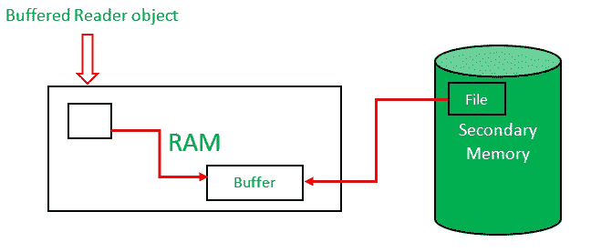

# 为什么 BufferedReader 在 Java 中抛出 IOException？

> 原文:[https://www . geeksforgeeks . org/why-do-bufferedeeler-throw-ioexception-in-Java/](https://www.geeksforgeeks.org/why-does-bufferedreader-throw-ioexception-in-java/)

IOException 是一种在输入/输出操作过程中出现的[检查异常](https://www.geeksforgeeks.org/checked-vs-unchecked-exceptions-in-java/)。[缓存器](https://www.geeksforgeeks.org/java-io-bufferedreader-class-java/)用于从文件、输入流、数据库等读取数据。下面是在 java 中如何使用 BufferedReader 读取文件的简化步骤。

1.  在内存中创建一个缓冲的读取器对象。
2.  文件的某些行是从辅助存储器(或硬盘)复制的，并存储在内存的缓冲区中。
3.  现在，在缓冲读取对象的帮助下，我们的程序可以读取内存中的缓冲区。
4.  如果所有的行都被读取，那么接下来文件的一些行被从辅助存储器复制到缓冲器中。



缓冲阅读器工作流程概述

由于多种原因，此文件系统读取随时可能失败。这可能是由于文件被删除或文件中有病毒。有时 BufferedReader 会从网络流中获取数据，而读取系统随时可能出现故障。

因此，当使用缓冲恐惧器时，这种类型的错误会出现在输入操作中。这就是为什么缓冲的读取器会抛出 IOException。

**下面是 BufferedReader 使用的一个例子**

```
Input: a = 5, b = 3
Output: 8
```

实施:

## Java 语言(一种计算机语言，尤用于创建网站)

```
// This is an example of use of BufferedReader Class

import java.io.*;

class GFG {

    // Define BufferedReader object
    static BufferedReader br = new BufferedReader(
        new InputStreamReader(System.in));

    // If you delete 'throws IOException'
    // you will get an error
    public static void main(String[] args)
        throws IOException
    {
        int a = Integer.parseInt(br.readLine());
        int b = Integer.parseInt(br.readLine());
        System.out.println(a + b);
    }
}
```

**输出:**


如果在从服务器端读取输入时从服务器端删除文件，则会引发 IOException。