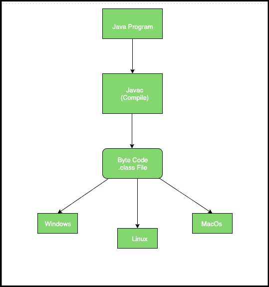
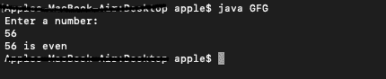

# 为什么 Java 是‘一次编写，随处运行’？

> 原文:[https://www . geesforgeks . org/why-is-Java-write-one-and-run-anywhere/](https://www.geeksforgeeks.org/why-is-java-write-once-and-run-anywhere/)

[JVM(Java 虚拟机)](https://www.geeksforgeeks.org/jvm-works-jvm-architecture/)充当运行 Java 应用的运行时引擎。JVM 实际上是调用 Java 代码中存在的主方法。JVM 是 [JRE(Java 运行时环境)](https://www.geeksforgeeks.org/differences-jdk-jre-jvm/)的一部分。

Java 应用程序被称为 **WORA(写一次运行在任何地方)**。这意味着程序员可以在一个系统上开发 Java 代码，并可以期望它在任何其他支持 Java 的系统上运行，而无需任何调整。这都是可能的，因为有了 JVM。

**WORA 有多爪哇:**

在像 C、C++这样的传统编程语言中，当程序被编译时，它们曾经被转换成特定底层硬件所理解的代码，所以如果我们试图在另一台具有不同硬件的机器上运行相同的代码，而该机器理解不同的代码会导致错误，因此您必须重新编译代码以被新硬件理解。

在 Java 中，程序不被转换成硬件直接理解的代码，而是被转换成[字节码(。类文件)](https://www.geeksforgeeks.org/java-class-file/)，由 JVM 解释，所以一旦编译就生成字节码文件，可以在任何有 JVM( Java Virtual Machine)的地方(任何机器)运行，因此具有一次写入，随处运行的性质。

[](https://media.geeksforgeeks.org/wp-content/uploads/20190521075104/Screenshot-2019-05-21-at-7.50.21-AM.png)

**示例:**WORA 的实际实现使用一个简单的 JAVA 程序来检查一个数字是偶数还是奇数。

```
import java.util.Scanner;

class GFG {
    public static void main(String args[])
    {
        int num;
        System.out.println("Enter a number:");
        Scanner input = new Scanner(System.in);
        num = input.nextInt();
        if (num % 2 == 0)
            System.out.println(num + " is even");
        else
            System.out.println(num + " is odd");
    }
}
```

*   **用于编译(在 Windows 10 上完成):**

    ```
    javac GFG.java

    ```

*   编译后，相应的文件夹中会有一个类文件，名为:

    ```
    GFG.class

    ```

*   当复制字节码时(。类)编译到一个 **macOS 10.14.3** 并运行它，我们得到以下输出。[](https://media.geeksforgeeks.org/wp-content/uploads/20190418135921/Screenshot-2019-04-18-at-1.57.16-PM.png) 

    爪哇程序在窗子上编译并在苹果电脑中运行

**结论:**
综上所述， **Java** 在编译时会创建一个**字节码(。类文件)**，可以在**任何支持 JVM** 的机器上运行。所以一旦编译了它**就不需要在它运行的每台机器上重新编译**，JVM 将字节码转换为底层硬件能够理解的代码。