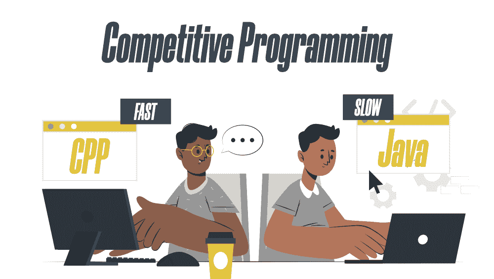
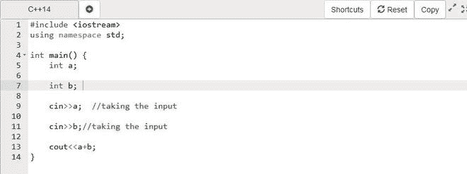
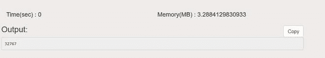
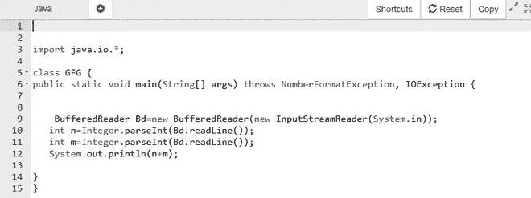
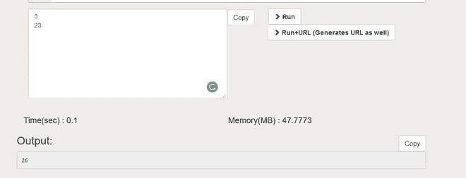
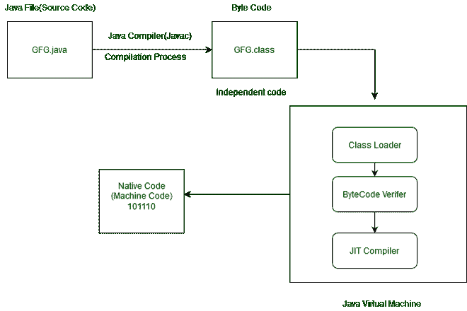

# 为什么 Java 语言比竞争编程的 CPP 慢？

> 原文:[https://www . geesforgeks . org/why-Java-language-比-CPP-for-competitive-programming/](https://www.geeksforgeeks.org/why-java-language-is-slower-than-cpp-for-competitive-programming/)

在开始竞争性编程时选择合适的语言是最重要的因素。一般来说，我们会选择语法简短、执行速度非常快的语言或者我们熟悉的语言，并且我们知道该特定语言的所有工作模式，无论是 Java 还是 C++。



大多数程序员使用 C++进行竞争性编程，也有许多老程序员转向 C++。像 Gennady Korotkevich、Errichto 和其他许多程序员一样，被评为最有竞争力的程序员使用 C++进行竞争性编程**，但是为什么用于竞争性编程的**[**【Java】**](https://www.geeksforgeeks.org/java/)**的句柄比 C++少得多呢？让我们理解一下**

**C++简单加法程序:**

 

**Java 简单加法程序:**

 

我们可以看到，C++的执行时间和内存比 Java 程序要小得多。这对大项目来说是一个非常大的问题。

与 C++相比，java 在竞争性编程中速度慢的原因有几个，这使得程序员避免使用它。一些常见的如下…

### **1。为输入/输出操作选择错误的类或使用错误的语法**

与 C++ **相比，Java 语言并不是很慢。**JAVA 中一般有两个类用于 I/O 操作， [Scanner](https://www.geeksforgeeks.org/scanner-class-in-java/) 类， [BufferedReader](https://www.geeksforgeeks.org/java-io-bufferedreader-class-java/) 类。大多数程序员，尤其是初学者，使用扫描仪类进行输入输出操作，由于长语法，避免使用缓冲读取器类进行输入输出。

扫描器类中的内部解析操作使得程序的执行非常慢，而缓冲读取器类只读取输入，并且根据操作的需要进行进一步的解析。在竞争编程中使用 Scanner 类为 java 程序创建 TLE 问题。

关于如何避免 Java 中的 TLE 已经发表了很多文章，即[【如何摆脱 Java TLE 问题】](How to get rid of Java TLE problem)[一个在线法官如何工作，如何避免超时限问题？](https://www.geeksforgeeks.org/how-an-online-judge-works-and-how-to-avoid-time-limit-exceeded-problem/)等。简而言之，所有文章都建议使用缓冲读取器类来代替扫描仪类进行输入/输出操作。

## Java 语言(一种计算机语言，尤用于创建网站)

```java
import java.io.*;
import java.util.*;

class GFG {

public static void main(String[] args) throws NumberFormatException, IOException {

        // Reading the input and performing internal parsing
        Scanner scan = new Scanner(System.in);

        int n = scan.nextInt();

        // Reading the input as a Stream Using InputStreamReader
        BufferedReader Bd = new BufferedReader(new InputStreamReader(System.in));

        // converting the String into int datatype
        int m = Integer.parseInt(Bd.readLine());
    }
}
```

从文章[中阅读更多关于这个主题的内容如何在竞争编程的 VSCode 中创建 Java 代码片段？](https://www.geeksforgeeks.org/how-to-create-java-snippets-in-vscode-for-competitive-programming/)如果你想知道如何降低 java 语言的执行速度，那就去看看《竞争编程》中的文章[Java 中的快速输入输出](https://www.geeksforgeeks.org/fast-io-in-java-in-competitive-programming/)。

C++语言也很快，因为它离机器和寄存器很近。这就是为什么 C++也用于嵌入式电路而不是 Java 的原因。

### 2 **。编制和执行流程**

编程语言可以根据其程序的执行和编译过程进行区分。有些语言是解释语言，这意味着解释器逐行检查特定解释语言(如 Python)的语法。

编译语言直接将程序转换成机器代码。因此，这些语言比解释器语言快得多。解释器花很少的时间来分析源代码。然而，执行该过程的总时间要慢得多。与 C 或 C++等编译语言相比，这使得解释编程语言的执行速度非常慢。**这就是 Python 比 C++和 Java 慢的原因。**

**Java 既不是编译语言，也不是解释语言。**位于中间。Java 是一种独立于平台的语言，这使得它在所有编程语言中非常受欢迎。字节码使其成为独立于平台的语言。这就是 Java 的优势。

它使程序的执行比 C++程序慢，因为没有像 C++中的 Java 那样为了执行和编译而发生的中间操作。程序执行缓慢的原因是，如果虚拟机没有运行，启动 Java 代码会有巨大的开销。

**JAVA 程序的编译执行过程:**



### **3。内存消耗**

Java 程序的内存消耗比 C++程序多。(参考以上 Java 和 C++的程序)。

我们都知道 Java 本身管理内存，不需要程序员的明确干预。垃圾收集器本身确保未使用的空间得到清理，并且可以在不需要时释放内存。所以额外的垃圾收集器需要额外的内存来跟踪 java 程序的所有内存消耗。

对于 java 程序员来说，不处理内存管理是有益的。这是由 JVM 和垃圾收集器自动完成的，但是垃圾收集器在 C++中不存在。内存泄漏是有可能的，但是这使得 C++程序非常简单。

因此，与 Java 程序相比，C++程序的内存消耗非常少。**结果**、**这有助于在** **快速执行 C++程序。**

> *“如果你的武器很锋利，你赢得比赛的机会就会增加”*

我们可以为竞争性编程选择任何语言，但首先，我们必须清楚它的所有基本主题以及特定语言如何工作，这对初学者非常有益。