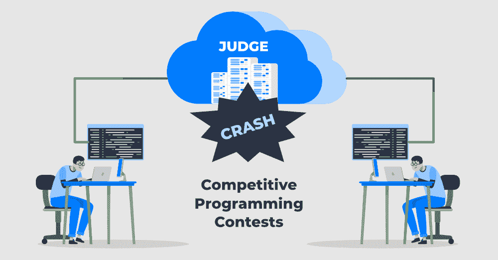
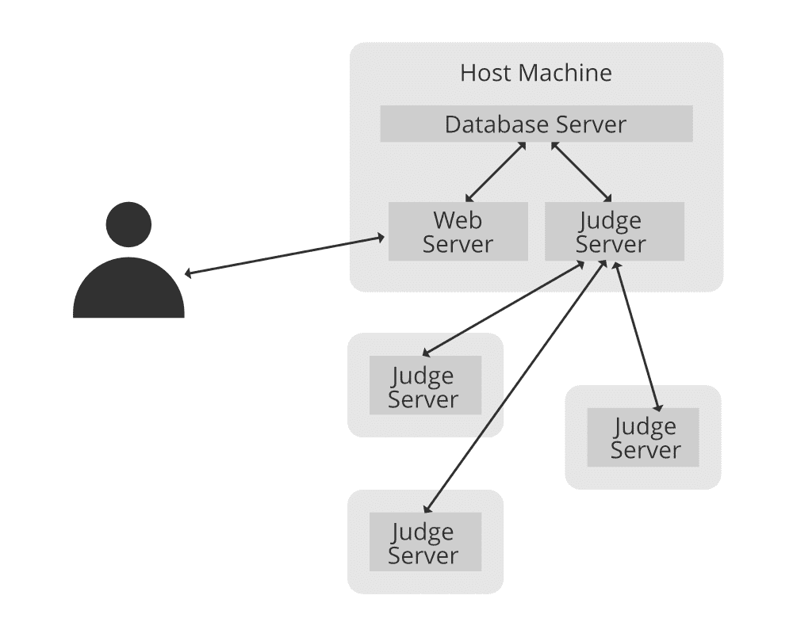

# 为什么在线评委在竞技编程比赛中崩溃？

> 原文:[https://www . geesforgeks . org/why-online-judge-crash-in-competition-programming-competitions/](https://www.geeksforgeeks.org/why-online-judge-crashes-during-competitive-programming-contests/)

Geek 正如你所熟知的，编码平台包括竞争性编码，如 GeeksforGeeks、CodeChef、Codeforces、atCoder、SPOJ、HackerRank、HackerEarth 等，在这些平台上，它应该通过直接写在各自的编辑器上或附加本地编辑器文件(如崇高编辑器)来自己编码。

你有没有想过测试用例是如何被访问的，或者更简单地说，我们的代码是如何被编译和运行来检查测试用例的？在这些竞争编程相结合的平台上**在线法官**充当代码提交的骨干。

> **重要免责声明:**在我们继续之前，请参考这张图片以获得更好的理解。

从上面的图片可以清楚地看到，一个在线裁判收集并运行了你的代码，显示出一些让步或决定。有那么基础吗？不，这整个互动非常混乱。与之相关的不便之处如下:

1.  **时限完成:**你的代码需要在某个时间出来。默认情况下，我们可以在操作系统上执行线程时设置时间限制吗？
2.  **内存限制完成:**您的程序不会占用 CPU 上的所有内存。我们如何改变这种情况，更简单的方法？
3.  **堆栈溢出错误:**跟踪你的程序后，系统会了解程序是否运行成功。我们如何获得这些信息？

好了，以上都是检查程序的复杂系统。虽然他们有一些安全问题。由于允许用户在 web judge 上提交任何类型的代码，很明显，有些人可能会提交一些恶意代码。有多狠？

*   一些代码可以执行不同的进程。
*   一些代码可以调查您的文档目录，并获得一点信息。
*   有些代码可以运行管理命令。
*   一些代码会吞噬服务器的带宽。

有很多事实，一个代码可以做到。你显然不需要允许这个系统这么做。那么，我们如何实施这些许可指南呢？所以极客现在你一定想知道一个网站是如何决定处理上述场景的，我们将提出如下方法:

**方式:**

有两种代码沙箱方法，web 决定通过它们来处理上述不同的场景

1.  蹩脚的方式
2.  漫长的历史道路

> 总之，限制系统保护的权限和硬件的技术被称为代码沙盒。

**方式 1:** 跛行方式

我甚至看到了一些在线决策活动，在这些活动中，开发人员试图在执行代码之前发现代码的恶意功能。例如，如果你的代码在 C++上，决定将首先看看是否有任何代码行使用了“系统”短语。这个答案不会画的原因是多种多样的，因为许多编程语言不会用相同的方式画。你可以动态地生成一个特性，并用几种编程语言来接触它，这样过滤就不会在一个人的代码中画东西了。还有一点，万一要打印“系统”作为输出呢？这个答案会说代码是恶意的，但它不是。

**方式二:**冗长的历史方式

在这种方法中，最大网络决定工作。这个答案与基于 Linux 的完全系统有关。

堆栈溢出/运行时错误可以通过程序的回溯成本来检查。如果是远 0，那么你可以说这个系统运行成功了，在其他任何情况下都崩溃了。

内存限制麻烦和时间限制可以使用各种基于 Unix 的完全库来提供。一些编程语言通过默认方式启用这种形式的限制标志，例如，Java。内存限制的缺点和时间限制的界限可能会提供给许多主要基于 Unix 的完全库的使用。一些编程语言通过默认来帮助标记这种类型的边界，例如，Java。

目录权限在 Linux 上很简单，您只需创建一个使用者，并允许该使用者拥有几个目录以及几个读/写权限。然后执行一个应用程序，用户的使用，文档列表的麻烦就可以解决了。此外，该代码不能运行一些管理命令。

限制社区技能同样是可行的，比如使用一些库，比如涓流。在这个解决方案中，人们希望建立不同的库，编写不同的代码来弥补一个安全漏洞。

**当代方式如下:**

如果您使用 Docker 或 box 主要基于完全虚拟机(Virtual Machine)，上述所有问题都将得到解决。如果你想有一个初步的记忆，你可以创建一个盒子，有预设的社区权限，盒子的时间限制。所有的麻烦都可以通过使用虚拟机来解决。开发人员完全可以意识到替代的东西。在这种解决方案中，整个判断机器还可以看起来比替代技术更慢，但是绝对在大规模上，它比其他任何解决方案都要快得多，也更安全。你可以看看这个 GitHub Repo，了解 docker 是如何用于判断的。

这种完整的评判方式是在线评判最重要的一部分。为了加强判断机器，人们想要理解操作系统是如何工作的，此外还要理解编程语言是如何工作的。希望你已经得到了最少一些关于整个方式的知识。