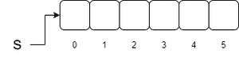

# 为什么我们需要 Java 中的集合框架？

> 原文:[https://www . geesforgeks . org/why-we-need-collection-framework-in-Java/](https://www.geeksforgeeks.org/why-we-need-collection-framework-in-java/)

框架是一组 [类](https://www.geeksforgeeks.org/classes-objects-java/) 和 [接口](https://www.geeksforgeeks.org/interfaces-in-java/) ，它们提供了现成的架构。为了实现新的特性或类，不需要定义框架。然而，一个最佳的面向对象设计总是包括一个包含一组类的框架，这样所有的类都执行相同类型的任务。在引入集合框架(或 JDK 1.2)之前，对 Java 对象(或集合)进行分组的标准方法是数组或向量，或哈希表。所有这些集合都没有公共接口。因此，尽管所有集合的主要目的是相同的，但是所有这些集合的实现是独立定义的，并且它们之间没有相关性。此外，用户很难记住每个集合类中存在的所有不同的方法、语法和构造函数。

[Collection Framework](https://www.geeksforgeeks.org/collections-in-java-2/) 是 java 中一个功能强大的框架。该框架定义了可用于任何对象集合的最常见方法。但是问题出现了，我们在 java 中有一个和 rray 的概念，那么为什么我们在 java 中需要收集框架呢？现在让我们看看为什么我们需要 java 中的集合框架，以及数组和集合之间的一些有效区别。

**语法:**声明变量

```java
int x = 10 or int y = 30
```

我们如上所示在程序中声明变量，这些变量被初始化为自定义随机整数值。但是像这样我们要申报多少元素？如果我想在代码中声明 100 和 1000 个元素，那么单变量声明方法不适合声明。这里数组的概念进入了画面。对于 1000 个变量或元素的声明，我们可以声明一个具有一定大小的数组。数组概念非常高效，适合各种操作。



**语法:**

```java
Student[]  s = new Student[5];
```

阵列对于某些操作非常有效，但是在使用阵列时存在一些限制，例如:

*   数组的大小是固定的，也就是说，一旦我们创建了一个具有一定大小的数组，那么就不会根据需求增加或减少它的大小。
*   数组只能保存同类数据元素。
*   数组概念不是基于一些标准数据结构实现的。因此，现成的方法不能满足需求。

插图:

```java
Student s = new Student[1000];
we can declare like this : s[0] = new Student
but we cannot declare like this : s[1] = new customer
```

为了克服数组的这些缺点或限制，我们需要 java 中的集合框架。集合框架用于各种操作，并具有各种内置方法。它们如下:

*   由于收集框架在本质上是可增长的，所以有些人不需要担心其大小。
*   集合框架可以容纳同质和异质对象。
*   收集框架是基于一些标准的数据结构实现的。因此，可以根据需要使用现成的方法。