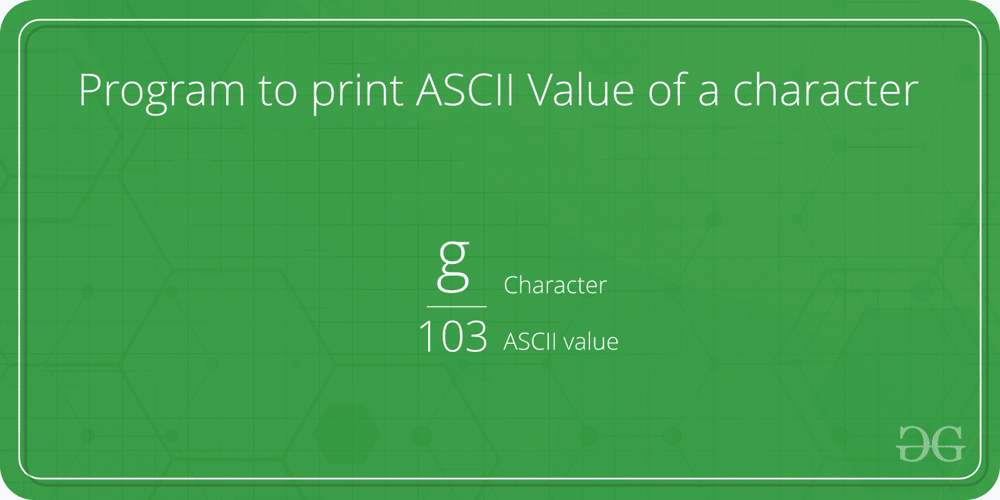

# Java 中的扩展原语转换

> 原文:[https://www . geesforgeks . org/加宽-原语-转换-in-java/](https://www.geeksforgeeks.org/widening-primitive-conversion-in-java/)

当我们在一个字母或字符串周围使用双引号时，我们都知道它被视为一个字符串，但是当我们在执行一些计算的同时使用一个单引号圆形字母时，它们被视为整数值，在打印时，我们必须了解 ASCII 表的概念，因为在计算机中，每个字符都区分大小写，在后端有一个特定的整数值分配给它，这突出了原始数据类型转换的扩展。参考这个[**【ASCII 表】**](https://www.geeksforgeeks.org/ascii-table/) ，只需偷看一下，因为你不再需要记住每个对应的值，只需要记住流行的值，因为它是在一些间隔内顺序定义的，如“A”、“A”等。

插图:



扩展基元转换用于转换下列规则指定的一个或两个操作数。在下列条件下，添加 Java 字符、短字符或字节的结果是一个int 数据类型:

*   如果任一操作数是 double 类型，则另一个操作数转换为 double。
*   否则，如果其中一个操作数是 float 类型，另一个操作数将转换为 float。
*   否则，如果任一操作数的类型为 long，则另一个操作数将转换为 long。
*   否则，两个操作数都转换为 int 类型


**例 1:**

## Java 语言(一种计算机语言，尤用于创建网站)

```java
// Java Program to Illustrate
// Widening Datatype Conversion
// No Computations

// Main class
public class GFG {

    // Main driver method
    public static void main(String[] args)
    {
        // Printing values on console
        System.out.print("Y"
                         + "O");
        System.out.print('L');
        System.out.print('O');
    }
}
```

**Output**

```java
YOLO
```

**输出解释:**

这将打印“YOLO”而不是“YO7679”。这是因为只有当像“+”这样的运算符出现时，扩展原语转换才会发生，它要求两边至少有一个整数。现在让我们坚持提出另一个案例如下:

**例 2:**

## Java 语言(一种计算机语言，尤用于创建网站)

```java
// Java Program to Illustrate
// Widening Datatype Conversion
// Computations is Carried Out

// Main class
public class GFG {

    // Main driver method
    public static void main(String[] args)
    {
        // Printing values on console
        System.out.print("Y"
                         + "O");

        // here computations is carried between letter
        // literal
        System.out.print('L' + 'O');
    }
}
```

**Output**

```java
YO155
```

**输出解释:**

当我们使用双引号时，文本被视为字符串并打印“YO”，但是当我们使用单引号时，字符“L”和“O”被转换为 int。这被称为扩展基元转换。转换为整数后，数字相加(‘L’是 76，‘O’是 79)并打印 155。

本文由 **Anurag Rai** 供稿。如果你喜欢极客博客并想投稿，你也可以写一篇文章并把你的文章邮寄到 review-team@geeksforgeeks.org。看到你的文章出现在极客博客主页上，帮助其他极客。