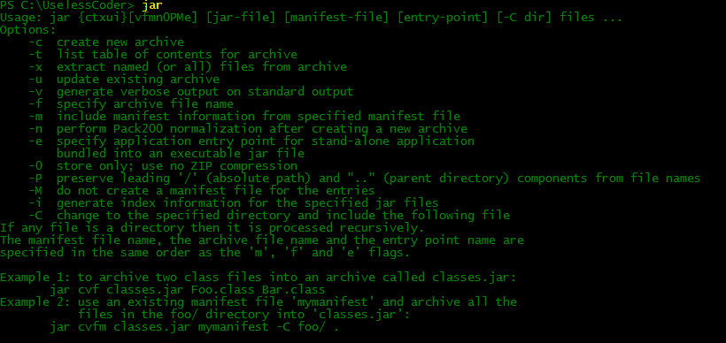
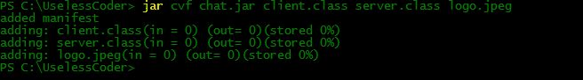
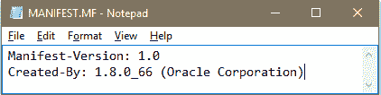
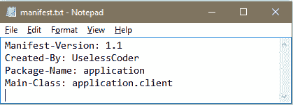
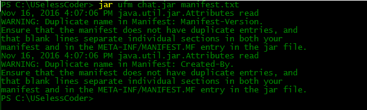
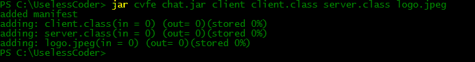

# 用 Java 处理 JAR 和清单文件

> 原文:[https://www . geesforgeks . org/work-with-jar-and-manifest-files-in-Java/](https://www.geeksforgeeks.org/working-with-jar-and-manifest-files-in-java/)

先决条件–[JAR 文件格式](https://www.geeksforgeeks.org/jar-files-java/)

每当一个开发人员想要分发他的软件的一个版本，那么他想要的只是分发一个单独的文件，而不是一个充满类文件的目录结构。JAR 文件就是为此而设计的。一个 JAR 文件可以包含类文件和其他文件类型，比如声音和图像文件，它们可能包含在项目中。JAR 文件中的所有文件都使用类似于 zip 的格式进行压缩。

**创建 JAR 文件–更多选项**

使用 jar 工具创建一个 jar 文件。一般命令看起来有点像这样:

```java
 jar options jar-file [manifest-file] file1 file2 file3 ...
```

*   **jar–文件:**要在其上使用 jar 工具的 jar 文件的名称。
*   **文件 1、文件 2、文件 3 :** 要添加到 jar 文件中的文件。manifest-file 是包含该 jar 文件清单的文件名，将 manifest-file 作为参数是完全可选的。
*   **c** :创建一个新的或空的档案，并向其中添加文件。如果任何指定的文件名是目录，那么 jar 程序递归地处理它们。
*   **C** :临时更改目录。
*   **e :** 在清单中创建一个入口点。
*   **f** :指定 JAR 文件名作为第二个命令行参数。如果缺少此参数，jar 会将结果写入标准输出(创建 JAR 文件时)或从标准输入中读取(提取或制表 JAR 文件时)。
*   **i** :创建索引文件。
*   **m** :在 JAR 文件中添加一个清单文件。清单是对归档内容和来源的描述。每个归档文件都有一个默认清单，但是如果您想验证归档文件的内容，可以提供自己的清单。
*   **M** :不为条目创建清单文件。
*   **t :** 显示目录。
*   **u :** 更新现有的 JAR 文件。
*   **v :** 生成详细输出。
*   **x :** 提取文件。如果提供一个或多个文件名，则仅提取这些文件。否则，将提取所有文件。
*   **0 :** 无 zip 压缩的店铺。

jar 命令的选项几乎与 UNIX tar 命令的选项相似。在 windows 中，您也可以通过在 cmd 中键入 jar，然后按 enter 键来获得关于 jar 命令的各种选项的帮助，输出将与下面类似:



示例:

要创建一个包含两个类 server.class 和 client.class 以及一个 Jpeg 图像 logo.jpeg 的 JAR 文件，需要编写以下命令:

```java
 jar cvf chat.jar server.class client.class logo.jpeg
```

上面命令的输出有点像这样:



使用 **-v** 选项和 jar 命令是一个更好的做法，因为你将了解事情是如何进行的。

**清单文件**

每个 JAR 文件包含一个描述归档特征的清单文件。默认情况下，每个 JAR 文件都有一个清单文件。默认清单文件被命名为清单。并且存在于归档文件的 META-INF 子目录中。虽然默认的清单文件只包含两个条目，但是复杂的清单文件可以有更多的方式。以下是默认清单文件的样子–



清单文件的条目分为几个部分。每个部分都有两个条目部分名称及其值。稍后我们将看到这些部分如何真正帮助我们控制归档的属性。也可以使用 jar 命令的 **m** 选项更新清单文件。但是在更新清单文件时有一些事情需要记住，否则你可能会得到以下令人毛骨悚然的消息。

```java
 java.io.IOException: invalid manifest format
```

**处理清单文件时要记住的事项:**

1.  您应该在清单文件中的任何部分的名称和值之间留出空间，就像版本:1.1 在有效的部分中，而不是写版本:1.1 冒号和 1.1 之间的空间真的很重要。
2.  While specifying the main class you should not add .class extension at the end of class name. Simply specify the main class by typing:

    ```java
    Main-Class: Classname
    ```

    (我将很快简要介绍主类部分)。

3.  您必须在文件末尾添加换行符。您不需要写\n 来指定换行符，只需将清单文件的最后一行留空即可。
4.  清单的文本文件必须使用 UTF-8 编码，否则您可能会遇到一些麻烦。

**示例:**

现在让我们回来更新 chat.jar 档案的内容。要更新清单文件，我们只需要编写以下命令:

```java
 jar uvfm chat.jar manifest.txt
```

这里 manifest.txt 是新的清单文件，它包含以下内容:



上面命令的输出有点像这样:



这里我们得到了两个警告，因为我们试图覆盖以前的条目。

**可执行 Jar 文件**

您可以使用 jar 命令的 **e** 选项来指定程序的入口点，即。启动 Java 应用程序时通常要调用的类。

**示例:**

要创建以客户端类为主类的 chat.jar 文件，您需要编写以下命令–

```java
 jar cvfe chat.jar client client.class server.class logo.jpeg
```

上面命令的输出有点像这样:



切记不要添加。要设置主类的类名后面的类扩展。

或者，您可以在清单文件中添加一个 Main-Class 条目，然后更新它。对于上面的例子，您只需要添加这个条目:

```java
 Main-Class: client
```

设置了 main 类后，只需编写以下命令即可运行 jar 程序–

```java
 java -jar chat.jar
```

根据操作系统配置，用户甚至可以通过双击 JAR 文件图标来启动应用程序。

**包装密封**

最后，我们将讨论 Java 中的包密封。我们可以用 Java 封装一个包，以确保没有其他类可以向其中添加自己。如果在代码中使用包可见的类、方法和字段，您可能希望密封包。没有包密封，其他类可以将自己添加到同一个包中，从而获得对包可见特性的访问。

*   要实现包密封，只需要将该包的所有类放入一个 JAR 文件中。
*   默认情况下，jar 文件中的包是不密封的，但是可以通过在清单文件中添加几行来更改全局默认值。
*   让我们再次考虑我们的 chat.jar 档案的情况，现在类 client.class 和 server.class 的包是 application，我们想要密封这个包，我们需要做的就是在清单文件中添加以下行并更新它。

    ```java
     Name: application
    Sealed: true
    ```

这都是从我这边关于如何使用 JAR 文件的。敬请关注！！

本文由**阿沛·拉纳(uselescoder)**供稿。如果你喜欢 GeeksforGeeks 并想投稿，你也可以使用[contribute.geeksforgeeks.org](http://contribute.geeksforgeeks.org)写一篇文章或者把你的文章邮寄到 contribute@geeksforgeeks.org。看到你的文章出现在极客博客主页上，帮助其他极客。

如果你发现任何不正确的地方，或者你想分享更多关于上面讨论的话题的信息，请写评论。