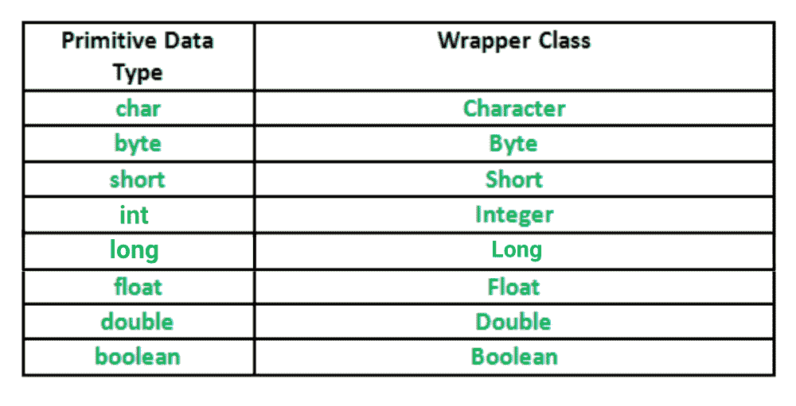

# Java 中的包装类

> 原文:[https://www.geeksforgeeks.org/wrapper-classes-java/](https://www.geeksforgeeks.org/wrapper-classes-java/)

包装类是对象包装或包含基本数据类型的类。当我们为包装类创建一个对象时，它包含一个字段，在这个字段中，我们可以存储原始数据类型。换句话说，我们可以将一个基元值包装到包装器类对象中。

**包装类的需求**

1.  它们将原始数据类型转换为对象。如果我们希望修改传递给方法的参数，就需要对象(因为基元类型是通过值传递的)。
2.  java.util 包中的类只处理对象，因此包装类在这种情况下也有帮助。
3.  集合框架中的数据结构，如[数组列表](https://www.geeksforgeeks.org/arraylist-in-java/)和[向量](https://www.geeksforgeeks.org/vector-vs-arraylist-java/)，只存储对象(引用类型)，不存储基元类型。
4.  需要一个对象来支持多线程中的同步。

**原始数据类型及其对应的包装类**



**汽车尾气和无毒**

**自动装箱:**将原语类型自动转换为其对应包装类的对象，称为自动装箱。例如–整数到整数、长到长、双到双等的转换。
例:

```
// Java program to demonstrate Autoboxing

import java.util.ArrayList;
class Autoboxing
{
    public static void main(String[] args)
    {
        char ch = 'a';

        // Autoboxing- primitive to Character object conversion
        Character a = ch;

        ArrayList<Integer> arrayList = new ArrayList<Integer>();

        // Autoboxing because ArrayList stores only objects
        arrayList.add(25);

        // printing the values from object
        System.out.println(arrayList.get(0));
    }
}
```

输出:

```
25
```

**拆箱:**只是自动装箱的反过程。将包装类的对象自动转换为其对应的基元类型称为取消装箱。例如–整数到整数、长到长、双到双等的转换。

```
// Java program to demonstrate Unboxing
import java.util.ArrayList;

class Unboxing
{
    public static void main(String[] args)
    {
        Character ch = 'a';

        // unboxing - Character object to primitive conversion
        char a = ch;

        ArrayList<Integer> arrayList = new ArrayList<Integer>();
        arrayList.add(24);

        // unboxing because get method returns an Integer object
        int num = arrayList.get(0);

        // printing the values from primitive data types
        System.out.println(num);
    }
}
```

输出:

```
24
```

**实施**

```
// Java program to demonstrate Wrapping and UnWrapping
// in Java Classes
class WrappingUnwrapping
{
    public static void main(String args[])
    {
        //  byte data type
        byte a = 1;

        // wrapping around Byte object
        Byte byteobj = new Byte(a);

        // int data type
        int b = 10;

        //wrapping around Integer object
        Integer intobj = new Integer(b);

        // float data type
        float c = 18.6f;

        // wrapping around Float object
        Float floatobj = new Float(c);

        // double data type
        double d = 250.5;

        // Wrapping around Double object
        Double doubleobj = new Double(d);

        // char data type
        char e='a';

        // wrapping around Character object
        Character charobj=e;

        //  printing the values from objects
        System.out.println("Values of Wrapper objects (printing as objects)");
        System.out.println("Byte object byteobj:  " + byteobj);
        System.out.println("Integer object intobj:  " + intobj);
        System.out.println("Float object floatobj:  " + floatobj);
        System.out.println("Double object doubleobj:  " + doubleobj);
        System.out.println("Character object charobj:  " + charobj);

        // objects to data types (retrieving data types from objects)
        // unwrapping objects to primitive data types
        byte bv = byteobj;
        int iv = intobj;
        float fv = floatobj;
        double dv = doubleobj;
        char cv = charobj;

        // printing the values from data types
        System.out.println("Unwrapped values (printing as data types)");
        System.out.println("byte value, bv: " + bv);
        System.out.println("int value, iv: " + iv);
        System.out.println("float value, fv: " + fv);
        System.out.println("double value, dv: " + dv);
        System.out.println("char value, cv: " + cv);
    }
}
```

**输出:**

```
Values of Wrapper objects (printing as objects)
Byte object byteobj:  1
Integer object intobj:  10
Float object floatobj:  18.6
Double object doubleobj:  250.5
Character object charobj: a
Unwrapped values (printing as data types)
byte value, bv: 1
int value, iv: 10
float value, fv: 18.6
double value, dv: 250.5
char value, cv: a

```

**相关文章:**
[Java 中自动装箱整数对象的比较](https://www.geeksforgeeks.org/comparison-autoboxed-integer-objects-java/)

本文由 **[尼尚·夏尔马](https://www.facebook.com/ChippingEye2766)** 供稿。如果你喜欢 GeeksforGeeks 并想投稿，你也可以使用[contribute.geeksforgeeks.org](http://www.contribute.geeksforgeeks.org)写一篇文章或者把你的文章邮寄到 contribute@geeksforgeeks.org。看到你的文章出现在极客博客主页上，帮助其他极客。

如果你发现任何不正确的地方，或者你想分享更多关于上面讨论的话题的信息，请写评论。