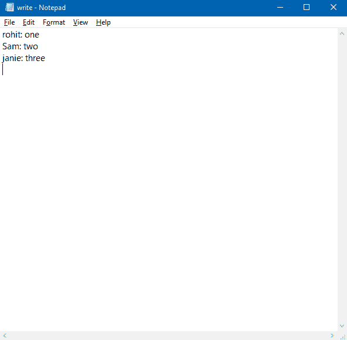

# 用 Java 写 HashMap 到文本文件

> 原文:[https://www . geesforgeks . org/write-hashmap-to-a-text-file-in-Java/](https://www.geeksforgeeks.org/write-hashmap-to-a-text-file-in-java/)

Java 中的 [HashMap](https://www.geeksforgeeks.org/java-util-hashmap-in-java-with-examples/) 类实现了 Serializable 接口，因此可以使用 **ObjectOutputStream** 将它的对象写入或序列化到文件中。但是，它生成的输出文件不是人类可读的格式，可能包含垃圾字符。

**序列化**:是将一个对象连同其属性和内容写入文件的过程。它在内部将对象转换成字节流。

**反序列化**:这是一个从文件中读取对象及其属性以及对象内容的过程。

> 如果我们想把一个 **HashMap** 对象写到一个纯文本文件中，我们需要一个简单易懂的代码写在 HashMap 上，然后把 Map 插入到文本文件中。我们可以用映射对象到文件的键值对的形式来编写代码，文件中的每一行都包含键值对

**接近**

*   在下面的类中，我们将 HashMap 内容存储在 hashmap.ser 序列化文件中。
*   当我们运行下面的代码时，它会生成一个 hashmap.ser 文件。该文件将在下一个类中用于反序列化。
*   hashmap.ser 序列化文件可以存储到任何位置，描述如下
*   所以我们需要位置来写 HashMap。
*   因此需要提供外部位置来存储哈希表

```java
final static String outputFilePath = "F:/Serialisation/write.txt";
```

创建**字符串键**和**字符串值对**的哈希表

```java
HashMap<String, String> map = new HashMap<String, String>();
```

创建文件对象:

```java
File file = new File(outputFilePath);
```

使用文件对象，我们将使用函数[**BufferedWriter**](https://www.geeksforgeeks.org/bufferedwriter-write-method-in-java-with-examples/)**(File _ Path)**编写 HashMap 输入

```java
 bf = new BufferedWriter( new FileWriter(file));
```

最后关闭文件

```java
 bf.close();
```

**写入文件**

## Java 语言(一种计算机语言，尤用于创建网站)

```java
// Java program to write HashMap to a file

import java.io.*;
import java.util.*;

class GFG {

    final static String outputFilePath
        = "F:/Serialisation/write.txt";

    public static void main(String[] args)
    {

        // create new HashMap
        HashMap<String, String> map
            = new HashMap<String, String>();

        // key-value pairs
        map.put("rohit", "one");
        map.put("Sam", "two");
        map.put("jainie", "three");

        // new file object
        File file = new File(outputFilePath);

        BufferedWriter bf = null;

        try {

            // create new BufferedWriter for the output file
            bf = new BufferedWriter(new FileWriter(file));

            // iterate map entries
            for (Map.Entry<String, String> entry :
                 map.entrySet()) {

                // put key and value separated by a colon
                bf.write(entry.getKey() + ":"
                         + entry.getValue());

                // new line
                bf.newLine();
            }

            bf.flush();
        }
        catch (IOException e) {
            e.printStackTrace();
        }
        finally {

            try {

                // always close the writer
                bf.close();
            }
            catch (Exception e) {
            }
        }
    }
}
```

**输出:**

