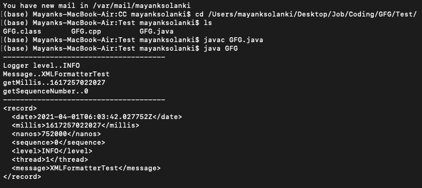
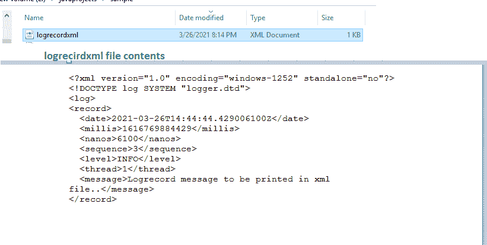

# Java 日志 API 中的 xmlformater

> 原文:[https://www . geesforgeks . org/xmlformater-in-Java-logging-API/](https://www.geeksforgeeks.org/xmlformatter-in-java-logging-api/)

在软件开发周期中，记录正在完成的一组动作总是好的。记录动作被称为记录。使用***Java . util . logging***包登录 Java(默认)记录数据。此外，我们还有第三方框架，如 Log4j、Logback 和 tinylog 等。，根据要求，选择日志框架的首选项有所不同。在 Java 中， ***java.util*** 包具有日志记录实用程序，日志记录非常需要以下导入:

```
import java.util.logging.ConsoleHandler;
import java.util.logging.FileHandler;
import java.util.logging.Handler;
import java.util.logging.Level;
import java.util.logging.LogManager;
import java.util.logging.Logger;
```

现在，让我们通过一个“属性文件”来检查日志消息显示的规范。在一个项目中，我们可以指定一个属性文件，它们可以跟踪日志记录功能的维护。其中，“Java . util . logging . console handler . formatter”指定要使用的 Formatter 类的名称，默认设置是 Java . util . logging . simple Formatter，它只不过是以纯文本显示日志条目。下面我们将使用**日志记录**来介绍 XMLFormatter，如下所示:

> 日志记录日志记录信息=新日志记录(级别。INFO，" xmlformaterttest ")；

***日志记录包含以下获取方法:***

**getLevel()–**可以是信息/警告等。，(消息的日志级别)

```
All     - 1
FINEST  - 2
FINER   - 3
FINE    - 4
CONFIG  - 5
INFO    - 6
WARNING - 7
SEVERE. - 8
OFF     - 9
```

**getMessage()–**在这里，它将显示 XMLFormatterTest，我们给出的示例如下

```
LogRecord logRecordInformation = new LogRecord(Level.INFO, "XMLFormatterTest");
```

**get illis()**–16167447995

get sequence number()–0

我们还有如下其他方法:

<figure class="table">

| 方法 | 已执行的操作 |
| --- | --- |
| getLoggerName() | 它返回记录器的名称。 |
| getParameters() | 它返回要插入到这个日志记录的消息中的参数。 |
| getResourceBundle() | 显示用于本地化此日志记录消息的信息(如果有)，否则返回空值。 |
| getResourceBundleName() | 它显示用于本地化此日志记录的消息的 ResourceBundle(如果有)的名称，否则返回 null。 |
| getSequenceNumber() | 它显示一个序列号 |
| getSourceClassName() | 它显示记录由该日志记录表示的消息的类的类名。 |

</figure>

**例 1:**

## Java 语言(一种计算机语言，尤用于创建网站)

```
// Java Program demonstrating XML Formatter Logging API

// Importing required libraries
import java.util.Calendar;
import java.util.GregorianCalendar;
import java.util.Locale;
import java.util.logging.Level;
import java.util.logging.LogRecord;
import java.util.logging.XMLFormatter;

// Main class
// XMLFormatterExample
public class GFG {

    // Main driver method
    public static void main(String[] args)
    {

        // A Locale object represents a specific
        // geographical, political, or cultural region Let
        // us take Locale.ENGLISH as the default in this
        // program
        Locale englishLocale = Locale.getDefault();

        // Try block to check for exceptions
        try {

            Locale.setDefault(Locale.ENGLISH);

            // Creating new object of GregorianCalendar
            // class
            GregorianCalendar calendar
                = new GregorianCalendar();

            int calendarYear = calendar.get(Calendar.YEAR);

            // There are different levels of setting
            // loggerInformation default level is INFO.

            // If the value is not specified, for our
            // example we have kept as INFO

            // other available levels are
            // ALL - 1,
            // FINEST - 2,
            // FINER - 3,
            // FINE - 4,
            // CONFIG - 5,
            // INFO - 6,
            // WARNING - 7,
            // SEVERE - 8,
            // OFF - 9
            LogRecord logRecordInformation = new LogRecord(
                Level.INFO, "XMLFormatterTest");

            // Display message for  better readability
            System.out.println(
                "--------------------------------------");

            // Printing logger levels, message,
            // getMillis,getSequenceNumber
            System.out.println(
                "Logger level.."
                + logRecordInformation.getLevel());
            System.out.println(
                "Message.."
                + logRecordInformation.getMessage());
            System.out.println(
                "getMillis.."
                + logRecordInformation.getMillis());
            System.out.println(
                "getSequenceNumber.."
                + logRecordInformation.getSequenceNumber());

            // Display message for better readability
            System.out.println(
                "--------------------------------------");

            // As we are using XMLFormatter, it displays the
            // output in XML format.
            //  It has higher visibility if used with UTF-8

            // Now creating object of XMLFormatter class
            XMLFormatter formatter = new XMLFormatter();

            String xmlFormatted
                = formatter.format(logRecordInformation);

            System.out.println(xmlFormatted);
        }

        // Executing the above code no matter
        // if there is exception or not
        finally {

            Locale.setDefault(englishLocale);
        }
    }
}
```

**输出:**



**例 2:**

## Java 语言(一种计算机语言，尤用于创建网站)

```
// Java Program demonstrating XML Formatter Logging API

// Importing required libraries
import java.util.logging.Level;
import java.util.logging.LogRecord;
import java.util.logging.XMLFormatter;

// Main class
// XMLFormatterExample1
public class GFG {

    // Main driver method
    public static void main(String[] args) throws Exception
    {

        // Creating an object of XMLFormatter class
        XMLFormatter xmlFormatter = new XMLFormatter();

        // Setting level to Info
        LogRecord logRecord = new LogRecord(
            Level.INFO,
            "Logrecord message to be printed in xml file..");

        // We can see the output of LogRecord in
        // logrecordxml.xml file
        FileHandler fileHandler
            = new FileHandler("logrecordxml.xml");
        fileHandler.setFormatter(xmlFormatter);

        // Prepared data is displayed in the
        // logrecordxml.xml file
        fileHandler.publish(logRecord);

        // Lastly releasing out all the records
        // using the flush() method
        fileHandler.flush();
    }
}
```

**输出:**不用在控制台打印，我们可以在 XML 文件中打印，如下图所示



> **结论:**
> 
> XML 符号对阅读和理解日志消息非常有帮助。因此，XMLFormatter 提供了一种有效的方法来实现这一点。许多人更喜欢使用 XMLFormatter，而不是产生纯文本格式输出的 SimpleFormatter。