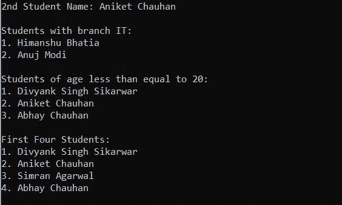

# Java 中的 XPath 赋值器

> 原文:[https://www.geeksforgeeks.org/xpath-evaluator-in-java/](https://www.geeksforgeeks.org/xpath-evaluator-in-java/)

众所周知，XML 文档用于存储和传输数据。因此，要从 XML 访问数据，我们需要能够访问每个节点和各自属性数据的东西。那么解决方案就是 XPath。XPath 可用于遍历 XML 文档、选择节点/元素和属性数据。这是 W3C 的建议，也是访问 XML 文档不同部分的灵活方式。编写 XPath 类似于在您的计算机系统中编写路径表达式，以遍历到特定的位置，如(C://School/家庭作业/assignment.docx)。

**考虑以下 XML 文档**

## 可扩展标记语言

```
<?xml version="1.0" encoding="UTF-8"?>
<students>
    <student branch="CSE">
        <name>Divyank Singh Sikarwar</name>
        <age>18</age>
        <city>Agra</city>
    </student>
    <student branch="CSE">
        <name>Aniket Chauhan</name>
        <age>20</age>
        <city>Shahjahanpur</city>
    </student>
    <student branch="CSE">
        <name>Simran Agarwal</name>
        <age>23</age>
        <city>Buland Shar</city>
    </student>
    <student branch="CSE">
        <name>Abhay Chauhan</name>
        <age>17</age>
        <city>Shahjahanpur</city>
    </student>
    <student branch="IT">
        <name>Himanshu Bhatia</name>
        <age>25</age>
        <city>Indore</city>
    </student>
    <student branch="IT">
        <name>Anuj Modi</name>
        <age>22</age>
        <city>Ahemdabad</city>
    </student>
    <student branch="ECE">
        <name>Manoj Yadav</name>
        <age>23</age>
        <city>Kota</city>
    </student>  
</students>
```

用于访问 XML 文档不同部分的 XPath 符号:

<figure class="table">

| 

标志

 | 

描述

 | 

例子

 | 

结果

 |
| --- | --- | --- | --- |
| **名称** | 从名称为' name '的 XML 中选择所有标记 | /学生/学生/姓名 | 显示所有名称 |
| **/** | 这代表文档的根 | /学生/学生/城市 | 显示每个学生的城市 |
| **//** | 选择节点，而不管它在哪里。 | //年龄 | 选择并显示所有年龄 |
| **@** | 要访问 XML 标记的属性值 | /学生/学生/@分公司 | 显示每个学生的分支 |
| **[ ]** | 它用于选择特定的节点 | /学生/学生[2]/姓名 | 显示**茴香脑** |

</figure>

### 让我们练习 XPath

考虑上面提到的 XML 文档:

选择第二名学生

> /学生/学生[2]/姓名

选择所有拥有分支信息技术的学生

> /学生/学生[@ branch =/“IT/”]/姓名

选择年龄小于等于 20 岁的所有学生

> /学生/学生[年龄< = 20]/姓名

前 4 名学生

> /学生/学生[职位()< = 4]/姓名

### 评估 XPath 表达式的 Java 代码

## Java 语言(一种计算机语言，尤用于创建网站)

```
import java.io.File;
import javax.xml.parsers.DocumentBuilder;
import javax.xml.parsers.DocumentBuilderFactory;
import javax.xml.xpath.XPath;
import javax.xml.xpath.XPathConstants;
import javax.xml.xpath.XPathExpression;
import javax.xml.xpath.XPathExpressionException;
import javax.xml.xpath.XPathFactory;
import org.w3c.dom.Document;
import org.w3c.dom.NodeList;

public class XPathDemo {

    public static void main(String[] args) throws Exception
    {
        File xmlFile = new File("student.xml");

        // Get DOM
        DocumentBuilderFactory dbf = DocumentBuilderFactory.newInstance();
        DocumentBuilder db = dbf.newDocumentBuilder();
        Document xml = db.parse(xmlFile);
        xml.getDocumentElement().normalize();

        // Get XPath
        XPathFactory xpf = XPathFactory.newInstance();
        XPath xpath = xpf.newXPath();

        // Find 2nd Student's name
        String name = (String)xpath.evaluate(
            "/students/student[2]/name", xml,
            XPathConstants.STRING);

        System.out.println("2nd Student Name: " + name);

        // find specific students name whose branch is IT
        NodeList nodes = (NodeList)xpath.evaluate(
            "/students/student[@branch = \"IT\"]/name", xml,
            XPathConstants.NODESET);

        System.out.println("\nStudents with branch IT:");
        printNodes(nodes);

        // find specific students 
        // name whose age is less
        // than equal to 20
        nodes = (NodeList)xpath.evaluate(
            "/students/student[age <= 20]/name", xml,
            XPathConstants.NODESET);

        System.out.println(
            "\nStudents of age less than equal to 20:");
        printNodes(nodes);

        // First 4 students from XML document
        nodes = (NodeList)xpath.evaluate(
            "/students/student[position() < 5]/name", xml,
            XPathConstants.NODESET);

        System.out.println("\nFirst Four Students: ");
        printNodes(nodes);
    }

    // prints nodes
    public static void printNodes(NodeList nodes)
    {
        for (int i = 0; i < nodes.getLength(); i++) {
            System.out.println(
                (i + 1) + ". "
                + nodes.item(i).getTextContent());
        }
    }
}
```

**输出:**



**上述代码中使用的类和方法的说明:**

*   类定义了从 xml 文档中获取 DOM 实例的应用编程接口。
*   **parse()** 方法将给定文件的内容解析为 XML 文档，并返回一个新的 DOM 对象。
*   **normalize()** 方法规范化给定文件的内容为一个 XML 文档。
*   可以使用**javax . XML . xpath . XPath factory**类实例创建包含 **evaluate()** 方法的 XPath 对象来评估我们编写的 XPath，并根据传递的参数返回字符串/Node/NodeSet，任何人(参见代码内部的 evaluate()方法)。
*   **position()** 是一个 XPath 函数，返回当前指定标签的位置。(在上面的代码中，指定的标记是“学生”)。同样，XPath 提供了一系列有用的函数，您可以探索它。