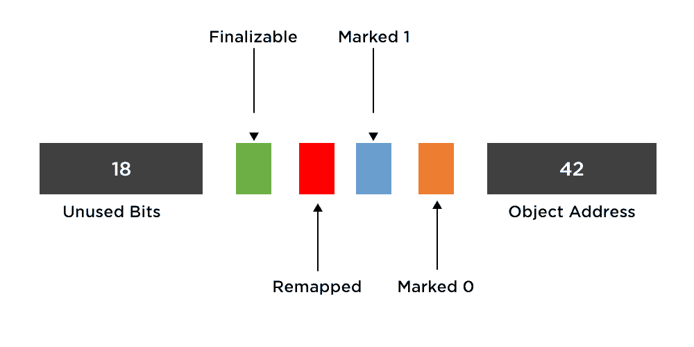

# Java 中的 Z 垃圾收集器

> 原文:[https://www.geeksforgeeks.org/z-garbage-collector-in-java/](https://www.geeksforgeeks.org/z-garbage-collector-in-java/)

如今，应用程序同时响应数千甚至数百万用户是很常见的。这样的应用程序需要不可估量的内存。然而，管理所有这些内存很容易影响应用程序的性能。为了克服这个问题，java 11 在 [**【垃圾收集】**](https://www.geeksforgeeks.org/garbage-collection-java/) 领域做了很多改进和改变。 [**Java 11**](https://www.geeksforgeeks.org/java-11-features-and-comparison/) 有一些很棒的功能，一个是 **Z 垃圾收集器(ZGC)** 。Z 垃圾收集器，也称为 ZGC，是一个低延迟可扩展的垃圾收集器，旨在满足以下目标。

*   暂停时间不得超过 10 毫秒
*   处理大小从 8MB 到 16TB 的堆
*   暂停时间不会随着堆或活动集的大小而增加。

简而言之，Z 垃圾收集器具有以下特点:

1.  同时发生的
2.  基于区域
3.  压制
4.  [**NUMA 感知**](https://www.geeksforgeeks.org/memory-mapped-i-o-and-isolated-i-o/) :非均匀内存访问(NUMA)是将一簇微处理器配置成多处理系统的一种方式，这样可以在本地共享内存，提高性能，扩展系统的能力。
5.  使用彩色指针
6.  使用负载屏障

**(一)Z 垃圾收集器的特点**

*   ZGC 同时执行所有高成本的工作，而不会停止应用程序线程执行超过 10ms，这使得它非常适合需要低延迟和/或使用非常大的堆(多万亿字节)的应用程序。
*   ZGC 在配置规模和方案上更加灵活。
*   ZGC 是一代气相色谱。它还支持部分压缩。

**(B)了解 Z 垃圾收集器**

要使用 Z 垃圾收集器，我们必须遵循多个步骤。您必须安装特定于 Linux/x64 的 JDK 二进制文件，并构建和启动它。您可以使用以下命令下载 ZGC 并将其构建在您的系统上:

```java
$ hg clone http://hg.openjdk.java.net/jdk/jdk
$ cd zgc
$ sh configure --with-jvm-features=zgc
$ make images
```

> 执行给定命令后，您可以在以下位置找到 JDK 根目录:

```java
g./build/linux-x86_64-normal-server-release/images/jdk 
```

**(C)实现:**基础 HelloGFG 类

## Java 语言(一种计算机语言，尤用于创建网站)

```java
// Java Program to Simply Create a Demo Class

// Importing input output libraries
import java.io.*;

// Main Class
class HelloGFG {
    // Main driver method
    public static void main(String[] args)
    {
        // Print statement
        System.out.println(
            "Hello to new Garbage Collector - ZGC!");
    }
}
```

**Output**

```java
Hello to new Garbage Collector - ZGC!
```

> 现在，以下命令可用于启用和使用 ZGC:
> 
> ```java
> java -XX:+UnlockExperimentalVMOptions -XX:+UseZGC HelloGFG
> ```

为了启用基本的 GC 记录，用户可以添加 **-Xlog:gc** 选项。在微调应用程序时，详细的日志记录很有帮助。用户可以使用 **-Xlog:gc*** 选项来启用它，如下所示:

```java
java -XX:+UnlockExperimentalVMOptions -XX:+UseZGC -Xlog:gc* HelloGFG
```

前面的命令会将所有日志输出到控制台，这可能会使搜索特定内容变得困难。用户可以指定要写入文件的日志，如下所示:

```java
java -XX:+UnlockExperimentalVMOptions -XX:+UseZGC -Xlog:gc:mylog.log* HelloGFG
```

**(D) Z 垃圾收集器堆**

ZGC 把记忆分成几个区域，也叫 ZPages。这些可以动态创建和销毁。ZGC 堆可以多次出现这些堆区域。中大型区域是连续分配的。这些也可以动态调整大小(与**[**【G1 GC】**](https://www.geeksforgeeks.org/types-of-jvm-garbage-collectors-in-java-with-implementation-details/)不同)，它们是 2 MB 的倍数。以下是堆区域的大小组:**

<figure class="table">

| 小的 | 2 MB |
| 中等 | 32 兆字节 |
| 大型 | N × 2 MB |

</figure>

****(E) Z 垃圾收集器阶段:****

**ZGC 的垃圾收集周期分为三个暂停。**

1.  ****暂停标记开始:**第一阶段，ZGC 在对象图中穿行，标记对象的直播或垃圾。该阶段还包括实时数据的重新映射。这是迄今为止 ZGC 垃圾收集周期中最繁重的工作负载之一。**
2.  ****暂停标记结束:**第二阶段是参考预处理完成的地方。类卸载和重定位集选择也在这个阶段完成。它还包括重定位集选择。ZGC 标记了它想要压缩的区域。**
3.  ****暂停重定位开始:**最后一个阶段是压缩堆的繁重工作发生的地方。**

****(F)彩色指针****

**彩色指针是 ZGC 的核心概念之一。它使 ZGC 能够找到、标记、定位和重新映射对象。它不支持 x32 平台。有色点的实现需要虚拟地址屏蔽，这可以在硬件、操作系统或软件中完成。下图显示了 64 位指针布局:**

**前 18 位保留供将来使用。这 42 位最多可寻址 4 TB 的地址空间。现在是剩下的，有趣的，4 位。标记 1 和标记 0 位用于标记垃圾收集的对象。通过设置“重新映射”的单个位，可以将对象标记为不指向重定位集。用于定案的最后 1 位与并发引用处理有关。它标志着一个对象只能通过终结器到达。**

****

**如上图所示，64 位对象引用划分如下:**

<figure class="table">

| 18 位 | 未使用的位 |
| 1 位 | 可终结的 |
| 1 位 | 重新映射 |
| 1 位 | 标记 1 |
| 1 位 | 标记 0 |
| 42 位 | 对象地址 |

</figure>

****(G)调谐 Z 垃圾收集器****

**ZGC 是一个并发垃圾收集器。通过设置应该分配给 ZGC 线程的 CPU 时间，用户可以控制垃圾收集的频率。这可以通过使用以下选项来实现:**

```java
**-XX:ConcGCThreads=<number>**
```

**ConcGCThreads 选项的值越高，留给应用程序的 CPU 时间就越少。另一方面，较低的值可能会导致应用程序为内存而挣扎；您的应用程序可能会产生比 ZGC 收集的更多的垃圾。ZGC 也可以为 ConcGCThreads 使用默认值。为了在这个参数上微调您的应用程序，您可能更喜欢根据测试值来执行。**

**对于高级 ZGC 调优，用户还可以启用大页面来提高应用程序的性能。可以通过使用以下选项来完成:**

```java
**-XX:+UseLargePages**
```

**除了启用大页面，用户还可以使用以下选项启用透明的大页面:**

```java
**-XX:+UseTransparentHugePage**
```

**上述选项还包括其他设置和配置，可以使用 ZGC 的官方维基页面进行访问。**

**ZGC 是一个 NUMA 意识的 GC。在 NUMA 机器上执行的应用程序可以带来显著的性能提升。默认情况下，ZGC 支持 NUMA。然而，如果 JVM 意识到它被绑定到 JVM 中的一个子集，这个特性可以被禁用。要覆盖 JVM 的决定，可以使用以下选项:**

```java
**-XX:+UseNUMA**
```

> ****结论:****
> 
> **在本文中，我们看到 ZGC 打算支持大堆大小和低应用程序暂停时间。我们已经简要讨论了 OpenJDK 的可扩展、低延迟的 GC—ZGC。这是一个实验性的 GC，从头开始写。作为并发垃圾收集，它承诺最大延迟小于 10 毫秒，这不会随着堆大小或实时数据而增加。目前**只和 Linux/x64** 配合使用。如果未来有相当大的需求，可以支持更多的平台。**