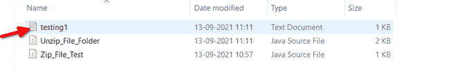

# Java 中的 ZIP API

> 原文:[https://www.geeksforgeeks.org/zip-api-in-java/](https://www.geeksforgeeks.org/zip-api-in-java/)

[Zip 文件](https://www.geeksforgeeks.org/difference-between-zip-and-rar/)是用于通过互联网传输文件的压缩文件。在编写应用程序时，Zip 和解压是非常重要的操作。Java 提供了丰富的应用编程接口来压缩和解压缩文件。通过在 java 中使用 ZIP API，我们可以压缩和解压成标准的 ZIP 和 g ZIP 格式。

一如既往，我们将讨论构造函数，而不是讨论方法，进而实现 ZIp API。让我们从如下构造函数开始:

**1。默认构造函数:**创建具有指定名称的 Zip 条目，并将字符串名称作为参数。

```java
ZipEntry() {}
```

**2。参数化构造函数:**使用指定的文件创建新的 zip 条目

**2.1** ZipEntry e

```java
ZipEntry(e) {}
```

**2.2** 文件文件:用于打开和读取指定文件对象的 ZIP 文件

```java
ZipFile(File) {}
```

**2.3** 用于打开和读取指定文件对象的 ZIP 文件

```java
ZipFile(File file, Charset charset) {{}
```

**现在让我们讨论如下方法:**

**方法 1: getEntry():** 告知指定名称的 zip 文件条目，如果找不到则为空。

**语法:**

```java
 getEntry()
```

返回类型:ZipEntry

参数:字符串名称

**方法 2: getInputStream():** 用于获取读取指定 zip 条目内容的输入流。

**语法:**

```java
getNextEntry()
```

**返回类型** : InputStream

**参数** : ZipEntry zipEntry

**方法 3:** putNextentry():开始写入新的 ZIP 文件条目。然后，它将流定位到条目数据的开头。

**语法:**

```java
putNextentry() {}
```

**返回类型:**无效

**参数** : ZipEntry e

**实施:**

**例 1**

## Java 语言(一种计算机语言，尤用于创建网站)

```java
// Java Program to Illustrate ZIP API
// To Zip a File

// Importing required classes
import java.io.FileInputStream;
import java.io.FileOutputStream;
import java.io.IOException;
import java.util.zip.ZipEntry;
import java.util.zip.ZipOutputStream;

// Class 1
// GfgZipDemo
public class GFG {

    // Main driver method
    public static void main(String[] argv)
    {

        // Calling method 2 inside main()
        GfgZipDemo.zip_one_file();
    }

    // Method 2
    // To perform ZIP on files
    public static void zip_one_file()
    {

        // Creating a byte array
        byte[] buffer = new byte[1024];

        // Try block to check for exceptions
        try {

            // Creating outputstream for writing the
            // information For ex c:\\desktop
            FileOutputStream fos = new FileOutputStream(
                "DESTINATION_PATH_WHERE_YOU_WANT_YOUR_ZIP");

            // Creating zip outputstream for zipping the
            // file by creating objects of ZipEntry and
            // ZipOutputStream classes
            ZipOutputStream zos = new ZipOutputStream(fos);
            ZipEntry ze = new ZipEntry("testing1.txt");

            zos.putNextEntry(ze);

            // For ex c:\\desktop\\abc.txt
            FileInputStream in
                = new FileInputStream("FILE_TO_ZIP_PATH");

            // Looping
            int lengths;
            // Holds true till there is something in byte
            // array as declared above of size 1024
            while ((lengths = in.read(buffer)) > 0) {

                // Write
                zos.write(buffer, 0, lengths);
            }

            // Closing file connections using close() method
            // Closing entries using closeEntry() method
            in.close();
            zos.closeEntry();
            zos.close();

            // Print message on console to illustrate
            // successful execution of program
            System.out.println("Successfully compiled and executed.");
        }

        // Catch block to handle exceptions
        catch (IOException ex) {

            // Display the exceptions along with line number
            // using printStackTrace() method
            ex.printStackTrace();
        }
    }
}
```

**输出:**在输入路径后生成的控制台上，您将获得以下输出

```java
Successfully compiled and executed.
```

从生成文件的图像中可以感知到，如下图所示的媒体:


**例 2**

## Java 语言(一种计算机语言，尤用于创建网站)

```java
// Java Program to Illustrate ZIP API
// Where we are Unzipping a File

// Importing required classes
import java.io.File;
import java.io.FileInputStream;
import java.io.FileOutputStream;
import java.io.IOException;
import java.util.List;
import java.util.zip.ZipEntry;
import java.util.zip.ZipInputStream;

// Main class
// GfgUnZipDemo
public class GFG {

    // Member variables of class
    List fileList;
    private static final String INPUT_ZIP_FILE
        = "YOUR_ZIP_FILE_PATH";
    // For ex c:\\desktop\\abc.zip
    private static final String OUTPUT_FOLDER
        = "YOUR_UNZIPPED_ZIP_FILE_PATH";
    // For ex c:\\desktop

    // Main driver method
    public static void main(String[] args)
    {
        // Creating object of class inside main()
        GFG unZip = new GFG();
        unZip.unZipIt(INPUT_ZIP_FILE, OUTPUT_FOLDER);
    }

    // Method 2
    // To unzip a file
    public void unZipIt(String zipFile, String outputFolder)
    {

        // Creating a byte array
        byte[] buffer = new byte[1024];

        // Try block to check for exceptions
        try {

            // Creating output directory
            File folder = new File(OUTPUT_FOLDER);

            // If there is a folder
            if (!folder.exists()) {
                folder.mkdir();
            }

            // Than get the zip file
            ZipInputStream zis = new ZipInputStream(
                new FileInputStream(zipFile));

            // Getting the zipped list entry
            ZipEntry ze = zis.getNextEntry();

            // Till file is not fully unzipped
            while (ze != null) {

                String fileName = ze.getName();
                File newFile
                    = new File(outputFolder + File.separator
                               + fileName);

                System.out.println(
                    "file unzip : "
                    + newFile.getAbsoluteFile());

                // Create all non exists folders else we
                // will get FileNotFoundException for
                // compressed folder
                new File(newFile.getParent()).mkdirs();

                FileOutputStream fos
                    = new FileOutputStream(newFile);

                int len;
                // read till there are characters
                while ((len = zis.read(buffer)) > 0) {
                    fos.write(buffer, 0, len);
                }

                // Closing file output stream connections
                fos.close();

                ze = zis.getNextEntry();
            }

            // Closing all remaining connections
            zis.closeEntry();
            zis.close();

            // Display message for successful compilatuiona
            // nd run
            System.out.println(
                "Successfully compiled and executed.");
        }

        // Catch block to handle exceptions
        catch (IOException ex) {

            // Display the exception along with line number
            // using printStackTrace() method
            ex.printStackTrace();
        }
    }
}
```

**输出:**在输入路径后生成的控制台上，您将获得以下输出

```java
Successfully compiled and executed.
```

从图像中可以看出，如下图所示的文件介质如下:

