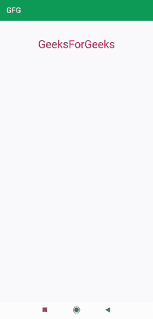

# 在安卓中放大和缩小到文本视图

> 原文:[https://www . geesforgeks . org/zoom-in-and-out-to-textview-in-Android/](https://www.geeksforgeeks.org/zoom-in-and-out-to-textview-in-android/)

在本文中，我们将在[文本视图](https://www.geeksforgeeks.org/working-with-the-textview-in-android/)中实现放大和缩小功能。当我们放大时，我们会看到放大后的图像。基本上，我们将学习如何在安卓系统中增加或减少文本大小。下面给出了一个 GIF 示例，来了解一下我们将在本文中做什么。注意，我们将使用 **Java** 语言来实现这个项目。



### **分步实施**

**第一步:创建新项目**

要在安卓工作室创建新项目，请参考[如何在安卓工作室创建/启动新项目](https://www.geeksforgeeks.org/android-how-to-create-start-a-new-project-in-android-studio/)。注意选择 **Java** 作为编程语言。

**步骤 2:使用 activity_main.xml 文件**

转到 **activity_main.xml** 文件，参考以下代码。下面是 **activity_main.xml** 文件的代码。

## 可扩展标记语言

```java
<?xml version="1.0" encoding="utf-8"?>
<LinearLayout
    xmlns:android="http://schemas.android.com/apk/res/android"
    xmlns:tools="http://schemas.android.com/tools"
    android:layout_width="match_parent"
    android:layout_height="match_parent"
    android:orientation="vertical"
    tools:context=".MainActivity">

    <TextView
        android:id="@+id/zoomin"
        android:layout_width="match_parent"
        android:layout_height="wrap_content"
        android:layout_marginTop="40dp"
        android:gravity="center"
        android:text="GeeksForGeeks"
        android:textColor="#CE1D59"
        android:textSize="32sp" />

</LinearLayout>
```

**第三步:使用****MainActivity.java 文件**

转到**MainActivity.java**文件，参考以下代码。以下是**MainActivity.java**文件的代码。代码中添加了注释，以更详细地理解代码。

## Java 语言(一种计算机语言，尤用于创建网站)

```java
import android.os.Bundle;
import android.view.MotionEvent;
import android.view.View;
import android.widget.TextView;

import androidx.appcompat.app.AppCompatActivity;

public class MainActivity extends AppCompatActivity implements View.OnTouchListener {

    TextView text;
    final static float move = 200;
    float ratio = 1.0f;
    int bastDst;
    float baseratio;

    @Override
    protected void onCreate(Bundle savedInstanceState) {
        super.onCreate(savedInstanceState);
        setContentView(R.layout.activity_main);
        text = findViewById(R.id.zoomin);
        text.setTextSize(ratio + 15);
    }

    @Override
    public boolean onTouchEvent(MotionEvent event) {
        if (event.getPointerCount() == 2) {
            int action = event.getAction();
            int mainaction = action & MotionEvent.ACTION_MASK;
            if (mainaction == MotionEvent.ACTION_POINTER_DOWN) {
                bastDst = getDistance(event);
                baseratio = ratio;
            } else {
                // if ACTION_POINTER_UP then after finding the distance
                // we will increase the text size by 15
                float scale = (getDistance(event) - bastDst) / move;
                float factor = (float) Math.pow(2, scale);
                ratio = Math.min(1024.0f, Math.max(0.1f, baseratio * factor));
                text.setTextSize(ratio + 15);
            }
        }
        return true;
    }

    // get distance between the touch event
    private int getDistance(MotionEvent event) {
        int dx = (int) (event.getX(0) - event.getX(1));
        int dy = (int) (event.getY(0) - event.getY(1));
        return (int) Math.sqrt(dx * dx + dy * dy);
    }

    @Override
    public boolean onTouch(View v, MotionEvent event) {
        return false;
    }
}
```

**输出:**

<video class="wp-video-shortcode" id="video-587800-1" width="640" height="360" preload="metadata" controls=""><source type="video/mp4" src="https://media.geeksforgeeks.org/wp-content/uploads/20210402235244/zoomtext.mp4?_=1">[https://media.geeksforgeeks.org/wp-content/uploads/20210402235244/zoomtext.mp4](https://media.geeksforgeeks.org/wp-content/uploads/20210402235244/zoomtext.mp4)</video>