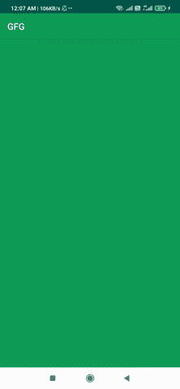

# 安卓缩放滚动视图

> 原文:[https://www.geeksforgeeks.org/zoom-scroll-view-in-android/](https://www.geeksforgeeks.org/zoom-scroll-view-in-android/)

在本文中，我们将在 ScrollView 上实现缩放。大多数时候，当我们创建一个滚动视图时，它包含大量数据，如果我们想在缩放时查看任何内容，那么我们可以实现这个功能。当我们在应用程序中滚动并使用 RecyclerView 包含数据时，此功能会很有用。在这里，我们可以实现这个功能，通过放大来查看 RecyclerView 中的数据。下面给出了一个示例 GIF，以了解我们将在本文中做什么。注意，我们将使用 **Java** 语言来实现这个项目。



### **分步实施**

**第一步:创建新项目**

要在安卓工作室创建新项目，请参考[如何在安卓工作室创建/启动新项目](https://www.geeksforgeeks.org/android-how-to-create-start-a-new-project-in-android-studio/)。注意选择 **Java** 作为编程语言。

**步骤 2:使用 activity_main.xml 文件**

导航到**应用程序> res >布局> activity_main.xml** 并将下面的代码添加到该文件中。下面是 **activity_main.xml** 文件的代码。

## 可扩展标记语言

```
<?xml version="1.0" encoding="utf-8"?>
<RelativeLayout 
    xmlns:android="http://schemas.android.com/apk/res/android"
    xmlns:tools="http://schemas.android.com/tools"
    android:layout_width="match_parent"
    android:layout_height="match_parent"
    tools:context=".MainActivity">

    <ScrollView
        android:id="@+id/scrollView"
        android:layout_width="match_parent"
        android:layout_height="match_parent"
        android:background="#1B5E20">

        <TextView
            android:layout_width="wrap_content"
            android:layout_height="wrap_content"
            android:text="Zoom Scroll View"
            android:textSize="32sp" />

    </ScrollView>

</RelativeLayout>
```

**第三步:使用****MainActivity.java 文件**

下面是实现该功能的代码。

```
// implementation of this feature
mScaleGestureDetector = new ScaleGestureDetector(this, new ScaleGestureDetector.SimpleOnScaleGestureListener(){
            @Override
            public boolean onScale(ScaleGestureDetector detector) {
                // firstly we will get the scale factor by which we want to zoom
                float scale = 1 - detector.getScaleFactor();
                float prevScale = mScale;
                mScale += scale;

                // we can maximise our focus to 10f only
                if (mScale > 10f)
                    mScale = 10f;

                ScaleAnimation scaleAnimation = new ScaleAnimation(1f / prevScale, 1f / mScale, 1f / prevScale, 1f / mScale, detector.getFocusX(), detector.getFocusY());

                // duration of animation will be 0.It will not change by self after that  
                scaleAnimation.setDuration(0);

                scaleAnimation.setFillAfter(true);

                // initialising the scrollview
                ScrollView layout = (ScrollView) findViewById(R.id.scrollView);

                // we are setting it as animation
                layout.startAnimation(scaleAnimation);
                return true;
       }
  });
```

以下是**MainActivity.java**文件的完整代码。代码中添加了注释，以更详细地理解代码。

## Java 语言(一种计算机语言，尤用于创建网站)

```
import android.os.Bundle;
import android.view.GestureDetector;
import android.view.MotionEvent;
import android.view.ScaleGestureDetector;
import android.view.animation.ScaleAnimation;
import android.widget.ScrollView;

import androidx.appcompat.app.AppCompatActivity;

public class MainActivity extends AppCompatActivity {
    private static final String TAG = "MainActivity";
    private float mScale = 1f;
    private ScaleGestureDetector mScaleGestureDetector;
    GestureDetector gestureDetector;

    @Override
    protected void onCreate(Bundle savedInstanceState) {
        super.onCreate(savedInstanceState);
        setContentView(R.layout.activity_main);

        // initialising the values
        gestureDetector = new GestureDetector(this, new GestureListener());
        mScaleGestureDetector = new ScaleGestureDetector(this, new ScaleGestureDetector.SimpleOnScaleGestureListener() {
            @Override
            public boolean onScale(ScaleGestureDetector detector) {

                // firstly we will get the scale factor
                float scale = 1 - detector.getScaleFactor();
                float prevScale = mScale;
                mScale += scale;

                // we can maximise our focus to 10f only
                if (mScale > 10f)
                    mScale = 10f;

                ScaleAnimation scaleAnimation = new ScaleAnimation(1f / prevScale, 1f / mScale, 1f / prevScale, 1f / mScale, detector.getFocusX(), detector.getFocusY());

                // duration of animation will be 0.It will 
                // not change by self after that
                scaleAnimation.setDuration(0);
                scaleAnimation.setFillAfter(true);

                // initialising the scrollview
                ScrollView layout = (ScrollView) findViewById(R.id.scrollView);

                // we are setting it as animation
                layout.startAnimation(scaleAnimation);
                return true;
            }
        });
    }

    @Override
    public boolean dispatchTouchEvent(MotionEvent event) {
        super.dispatchTouchEvent(event);

        // special types of touch screen events such as pinch ,
        // double tap, scrolls , long presses and flinch,
        // onTouch event is called if found any of these
        mScaleGestureDetector.onTouchEvent(event);
        gestureDetector.onTouchEvent(event);
        return gestureDetector.onTouchEvent(event);
    }

    private class GestureListener extends GestureDetector.SimpleOnGestureListener {
        @Override
        public boolean onDown(MotionEvent e) {
            return true;
        }

        @Override
        public boolean onDoubleTap(MotionEvent e) {
            return true;
        }
    }
}
```

**输出:**

<video class="wp-video-shortcode" id="video-590824-1" width="640" height="360" preload="metadata" controls=""><source type="video/mp4" src="https://media.geeksforgeeks.org/wp-content/uploads/20210405000902/zoomscrollv.mp4?_=1">[https://media.geeksforgeeks.org/wp-content/uploads/20210405000902/zoomscrollv.mp4](https://media.geeksforgeeks.org/wp-content/uploads/20210405000902/zoomscrollv.mp4)</video>